---
## Front matter
title: "Отчёт по лабораторной работе №2"
subtitle: "Дисциплина: архитектура компьютера"
author: "Кузнецова Елизавета Андреевна"

## Generic otions
lang: ru-RU
toc-title: "Содержание"

## Bibliography
bibliography: bib/cite.bib
csl: pandoc/csl/gost-r-7-0-5-2008-numeric.csl

## Pdf output format
toc: true # Table of contents
toc-depth: 2
lof: true # List of figures
lot: true # List of tables
fontsize: 12pt
linestretch: 1.5
papersize: a4
documentclass: scrreprt
## I18n polyglossia
polyglossia-lang:
  name: russian
  options:
	- spelling=modern
	- babelshorthands=true
polyglossia-otherlangs:
  name: english
## I18n babel
babel-lang: russian
babel-otherlangs: english
## Fonts
mainfont: PT Serif
romanfont: PT Serif
sansfont: PT Sans
monofont: PT Mono
mainfontoptions: Ligatures=TeX
romanfontoptions: Ligatures=TeX
sansfontoptions: Ligatures=TeX,Scale=MatchLowercase
monofontoptions: Scale=MatchLowercase,Scale=0.9
## Biblatex
biblatex: true
biblio-style: "gost-numeric"
biblatexoptions:
  - parentracker=true
  - backend=biber
  - hyperref=auto
  - language=auto
  - autolang=other*
  - citestyle=gost-numeric
## Pandoc-crossref LaTeX customization
figureTitle: "Рис."
tableTitle: "Таблица"
listingTitle: "Листинг"
lofTitle: "Список иллюстраций"
lotTitle: "Список таблиц"
lolTitle: "Листинги"
## Misc options
indent: true
header-includes:
  - \usepackage{indentfirst}
  - \usepackage{float} # keep figures where there are in the text
  - \floatplacement{figure}{H} # keep figures where there are in the text
---

# Цель работы

Изучить идеологию и применение средств контроля версий. Приобрести практические навыки по работе с системой git (с помощью git создать рабочее пространство и репозиторий курса, потом загрузить файлы на github).

# Задание

1. Создайте отчет по выполнению лабораторной работы в соответствующем каталоге
рабочего пространства (labs>lab02>report).
2. Скопируйте отчеты по выполнению предыдущих лабораторных работ в соответствующие каталоги созданного рабочего пространства.
3. Загрузите файлы на github.

# Теоретическое введение

Ядро Git представляет собой набор утилит командной строки с параметрами. Все настройки хранятся в текстовых файлах конфигурации. Такая реализация делает Git легко портируемым на любую платформу и даёт возможность легко интегрировать Git в другие системы (в частности, создавать графические git-клиенты с любым желаемым интерфейсом).

Репозиторий Git представляет собой каталог файловой системы, в котором находятся файлы конфигурации репозитория, файлы журналов, хранящие операции, выполняемые над репозиторием, индекс, описывающий расположение файлов, и хранилище, содержащее собственно файлы. Структура хранилища файлов не отражает реальную структуру хранящегося в репозитории файлового дерева, она ориентирована на повышение скорости выполнения операций с репозиторием. Когда ядро обрабатывает команду изменения (неважно, при локальных изменениях или при получении патча от другого узла), оно создаёт в хранилище новые файлы, соответствующие новым состояниям изменённых файлов. Существенно, что никакие операции не изменяют содержимого уже существующих в хранилище файлов.

С помощью широких возможностей Git программисты могут объединять свои репозитории — GitHub предлагает удобный интерфейс для этого и может отображать вклад каждого участника в виде дерева. 

# Выполнение лабораторной работы

Создала учетную запись на Github (рис. [-@fig:001]).

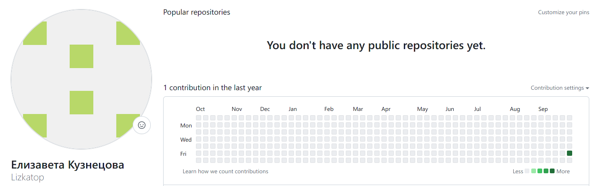{#fig:001 width=90%}

Указала имя и e-mail владельца репозитория (рис. [-@fig:002]).

{#fig:002 width=90%}

Настроила utf-8 в выводе сообщений git и задала имя “master” для начальной ветки (рис. [-@fig:003]).

{#fig:003 width=90%}

Настроила параметры autocrlf и safecrlf (рис. [-@fig:004]).

{#fig:004 width=90%}

Через команду ssh keygen -C настроила пару ключей (приватный и открытый) (рис. [-@fig:005]).

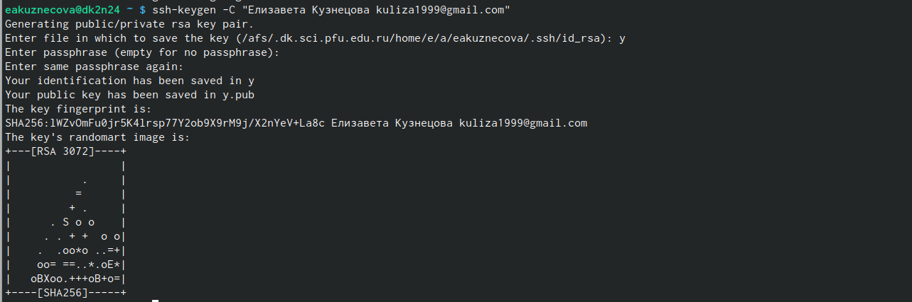{#fig:005 width=90%}

Скопировала ключ из локальной консоли в буфер обмена (рис. [-@fig:006]).

{#fig:006 width=90%}

Вставила ключ в появившееся на сайте поле и указала для ключа имя “Topchik” (рис. [-@fig:007]).

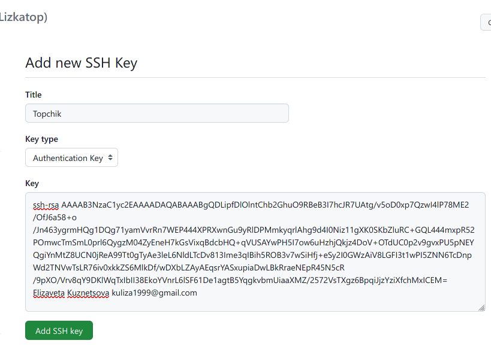{#fig:007 width=90%}

Создала SSH ключ (рис. [-@fig:008]).

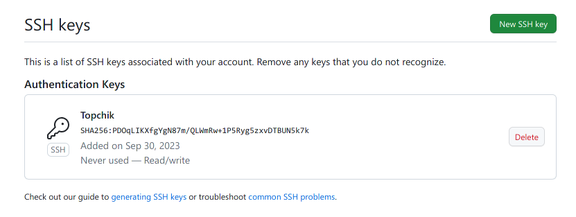{#fig:008 width=90%}

Создала каталог для предмета “Архитектура компьютера” (рис. [-@fig:009]).

{#fig:009 width=90%}

Создала репозиторий курса на основе шаблона через web-интерфейс github (рис. [-@fig:010]).

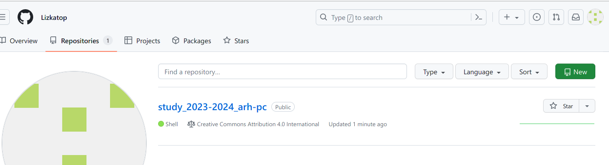{#fig:010 width=90%}

Воспользовалась терминалом и перешла в каталог курса, затем клонировала созданный репозиторий (рис. [-@fig:011]).

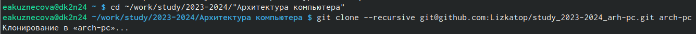{#fig:011 width=90%}

Перешла в каталог курса, удалила лишние файлы, создала необходимые каталоги (рис. [-@fig:012]).

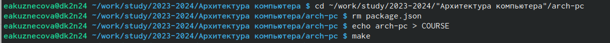{#fig:012 width=90%}

Воспользовалась командами git add . и git commit –am (рис. [-@fig:013]).

{#fig:013 width=90%}

Воспользовалась командой git push и отправила файлы на сервер (рис. [-@fig:014]).

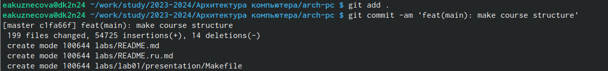{#fig:014 width=90%}

Проверила правильность создания иерархии рабочего пространства в локальном репозитории (рис. [-@fig:015]).

{#fig:015 width=90%}

Проверила правильность создания иерархии рабочего пространства на странице github (рис. [-@fig:016]).

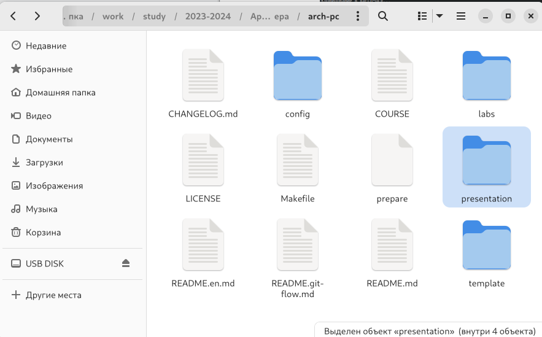{#fig:016 width=90%}

# Выполнение заданий для самостоятельной работы

Создала отчет по выполнению второй лабораторной работы в соответствующем каталоге рабочего пространства (рис. [-@fig:017]).

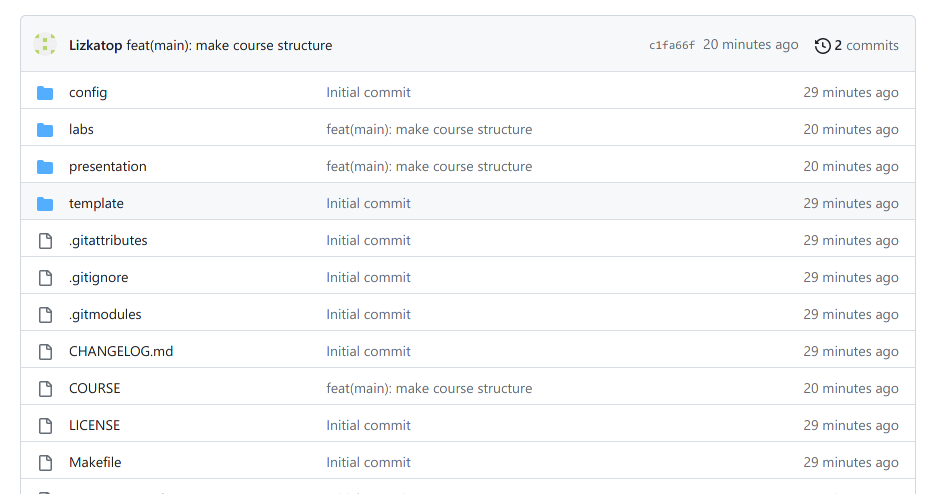{#fig:017 width=90%}

Скопировала отчет по выполнению первой лабораторной работе в соответствующие каталоги созданного рабочего пространства (рис. [-@fig:018]).

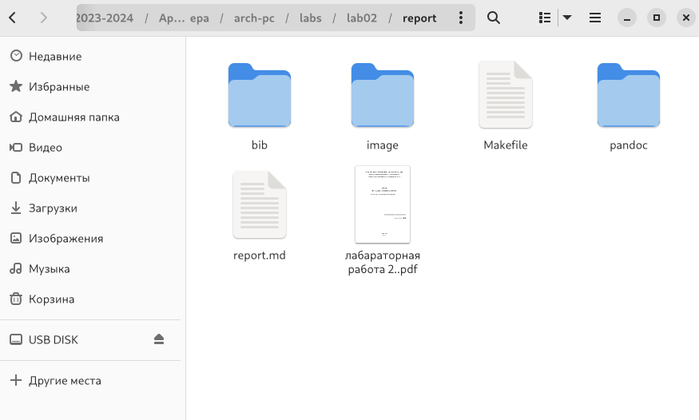{#fig:018 width=90%}

Загрузила файлы на github (рис. [-@fig:019]).

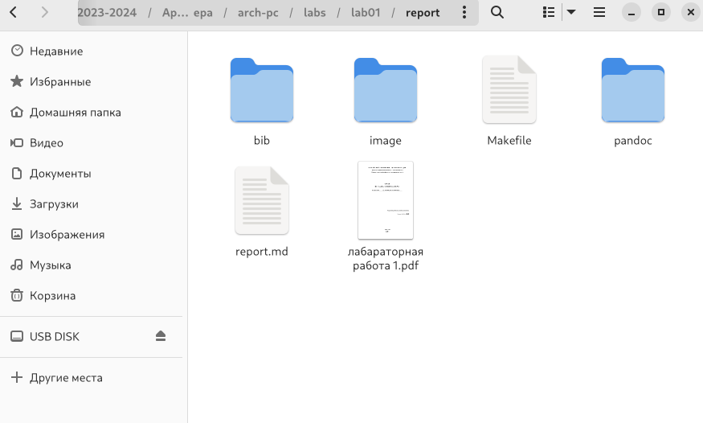{#fig:019 width=90%}

Проверила, что файлы появились на github (рис. [-@fig:020]).

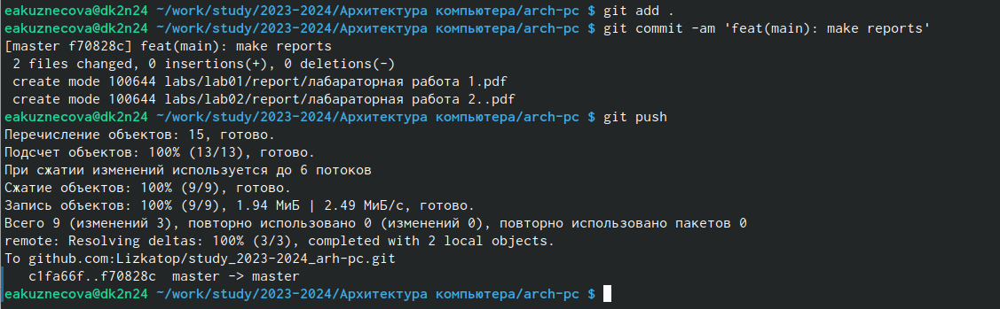{#fig:020 width=90%}

# Выводы

Идеология и применение средств контроля версий были изучены. Удалось создать иерархию рабочего пространства в локальном репозитории и на странице github.

