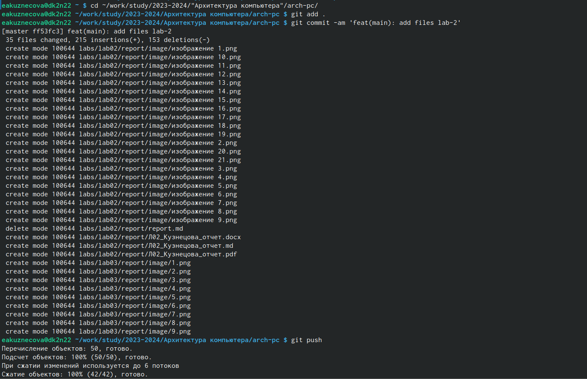

---
## Front matter
title: "Отчет по лабораторной работе №3"
subtitle: "Дисциплина: архитектура компьютера"
author: "Кузнецова Елизавета Андреевна"

## Generic otions
lang: ru-RU
toc-title: "Содержание"

## Bibliography
bibliography: bib/cite.bib
csl: pandoc/csl/gost-r-7-0-5-2008-numeric.csl

## Pdf output format
toc: true # Table of contents
toc-depth: 2
lof: true # List of figures
lot: true # List of tables
fontsize: 12pt
linestretch: 1.5
papersize: a4
documentclass: scrreprt
## I18n polyglossia
polyglossia-lang:
  name: russian
  options:
	- spelling=modern
	- babelshorthands=true
polyglossia-otherlangs:
  name: english
## I18n babel
babel-lang: russian
babel-otherlangs: english
## Fonts
mainfont: PT Serif
romanfont: PT Serif
sansfont: PT Sans
monofont: PT Mono
mainfontoptions: Ligatures=TeX
romanfontoptions: Ligatures=TeX
sansfontoptions: Ligatures=TeX,Scale=MatchLowercase
monofontoptions: Scale=MatchLowercase,Scale=0.9
## Biblatex
biblatex: true
biblio-style: "gost-numeric"
biblatexoptions:
  - parentracker=true
  - backend=biber
  - hyperref=auto
  - language=auto
  - autolang=other*
  - citestyle=gost-numeric
## Pandoc-crossref LaTeX customization
figureTitle: "Рис."
tableTitle: "Таблица"
listingTitle: "Листинг"
lofTitle: "Список иллюстраций"
lotTitle: "Список таблиц"
lolTitle: "Листинги"
## Misc options
indent: true
header-includes:
  - \usepackage{indentfirst}
  - \usepackage{float} # keep figures where there are in the text
  - \floatplacement{figure}{H} # keep figures where there are in the text
---

# Цель работы

Целью работы является освоение процедуры оформления отчетов с помощью легковесного языка разметки Markdown.

# Задание

1. В соответствующем каталоге сделайте отчёт по лабораторной работе № 2 в формате
Markdown. В качестве отчёта необходимо предоставить отчёты в 3 форматах: pdf, docx
и md.
2. Загрузите файлы на github.

# Теоретическое введение

Markdown — облегчённый язык разметки, созданный с целью обозначения форматирования в простом тексте, с максимальным сохранением его читаемости человеком, и пригодный для машинного преобразования в языки для продвинутых публикаций (HTML, Rich Text и других).

Документы Markdown легко экспортировать в любые форматы: PDF, DOC, ODT. При этом их форматирование остаётся неизменным.

# Выполнение лабораторной работы

Открыла терминал, перешла в каталог arch-pc, обновила локальный репозиторий с помощью команды git pull, перешла в каталог с шаблоном отчета по лабораторной работе №3 (рис. [-@fig:001]).

{#fig:001 width=80%}

Провожу компиляцию шаблона и проверяю корректность выполнения команды (рис. [-@fig:002]).

{#fig:002 width=80%}

Удаляю полученные файлы и проверяю, что файлы были удалены (рис. [-@fig:003]).

{#fig:003 width=80%}

Открываю файл report.md с помощью текстового редактора (рис. [-@fig:004]).

{#fig:004 width=80%}

Я заполнила отчет и скомпилировала его с использованием Makelife.Отчет в трех форматах предоставлен.

# Выполнение заданий для самостоятельной работы

Перехожу в каталог с отчетом по второй лабораторной работе (рис. [-@fig:005]).

{#fig:005 width=80%}

Открыла файл с шаблоном отчета и заполнила его (рис. [-@fig:006]).

{#fig:006 width=80%}

Переименовала файл, в котором заполняла отчет (рис. [-@fig:007]).

{#fig:007 width=80%}

Компилирую отчет (рис. [-@fig:008]).

{#fig:008 width=80%}

Проверяю, чтобы были созданы файлы (рис. [-@fig:009]).

{#fig:009 width=80%}

Загружаю файлы на Github (рис. [-@fig:010]).

{#fig:010 width=80%}

# Выводы

Я освоила процедуры оформления отчетов с помощью легковесного языка разметки Markdown.

