---
## Front matter
title: "Отчет по лабораторной работе №4"
subtitle: "Дисциплина: архитектура компьютера"
author: "Кузнецова Елизавета Андреевна"

## Generic otions
lang: ru-RU
toc-title: "Содержание"

## Bibliography
bibliography: bib/cite.bib
csl: pandoc/csl/gost-r-7-0-5-2008-numeric.csl

## Pdf output format
toc: true # Table of contents
toc-depth: 2
lof: true # List of figures
lot: true # List of tables
fontsize: 12pt
linestretch: 1.5
papersize: a4
documentclass: scrreprt
## I18n polyglossia
polyglossia-lang:
  name: russian
  options:
	- spelling=modern
	- babelshorthands=true
polyglossia-otherlangs:
  name: english
## I18n babel
babel-lang: russian
babel-otherlangs: english
## Fonts
mainfont: PT Serif
romanfont: PT Serif
sansfont: PT Sans
monofont: PT Mono
mainfontoptions: Ligatures=TeX
romanfontoptions: Ligatures=TeX
sansfontoptions: Ligatures=TeX,Scale=MatchLowercase
monofontoptions: Scale=MatchLowercase,Scale=0.9
## Biblatex
biblatex: true
biblio-style: "gost-numeric"
biblatexoptions:
  - parentracker=true
  - backend=biber
  - hyperref=auto
  - language=auto
  - autolang=other*
  - citestyle=gost-numeric
## Pandoc-crossref LaTeX customization
figureTitle: "Рис."
tableTitle: "Таблица"
listingTitle: "Листинг"
lofTitle: "Список иллюстраций"
lotTitle: "Список таблиц"
lolTitle: "Листинги"
## Misc options
indent: true
header-includes:
  - \usepackage{indentfirst}
  - \usepackage{float} # keep figures where there are in the text
  - \floatplacement{figure}{H} # keep figures where there are in the text
---

# Цель работы

Целью работы является освоение процедуры компиляции и сборки программ, написанных на ассамблере NASM.

# Задание

1. Создание программы Hello, world!
2. В каталоге ~/work/arch-pc/lab04 с помощью команды cp создайте копию файла
hello.asm с именем lab4.asm
3. С помощью любого текстового редактора внесите изменения в текст программы в
файле lab4.asm так, чтобы вместо Hello world! на экран выводилась строка с вашими
фамилией и именем.
4. Оттранслируйте полученный текст программы lab4.asm в объектный файл. Выполните
компоновку объектного файла и запустите получившийся исполняемый файл.
5. Скопируйте файлы hello.asm и lab4.asm в Ваш локальный репозиторий в ката-
лог ~/work/study/2023-2024/"Архитектура компьютера"/arch-pc/labs/lab04/.
Загрузите файлы на Github

# Теоретическое введение

Основными функциональными элементами любой электронно-вычислительной машины
(ЭВМ) являются центральный процессор, память и периферийные устройства.
Взаимодействие этих устройств осуществляется через общую шину, к которой они подключены. Физически шина представляет собой большое количество проводников, соединяющих
устройства друг с другом. В современных компьютерах проводники выполнены в виде электропроводящих дорожек на материнской (системной) плате.
Основной задачей процессора является обработка информации, а также организация
координации всех узлов компьютера. В состав центрального процессора (ЦП) входят
следующие устройства: арифметико-логическое устройство (АЛУ) — выполняет логические и арифметические действия, необходимые для обработки информации, хранящейся в памяти; устройство управления (УУ) — обеспечивает управление и контроль всех устройств
компьютера; регистры — сверхбыстрая оперативная память небольшого объёма, входящая в состав процессора, для временного хранения промежуточных результатов выполнения
инструкций; регистры процессора делятся на два типа: регистры общего назначения и
специальные регистры.
Для того, чтобы писать программы на ассемблере, необходимо знать, какие регистры
процессора существуют и как их можно использовать. Большинство команд в программах
написанных на ассемблере используют регистры в качестве операндов. Практически все
команды представляют собой преобразование данных хранящихся в регистрах процессора,
это например пересылка данных между регистрами или между регистрами и памятью, преобразование (арифметические или логические операции) данных хранящихся в регистрах.
Другим важным узлом ЭВМ является оперативное запоминающее устройство (ОЗУ).
ОЗУ — это быстродействующее энергозависимое запоминающее устройство, которое на-
прямую взаимодействует с узлами процессора, предназначенное для хранения программ и
данных, с которыми процессор непосредственно работает в текущий момент. ОЗУ состоит из
одинаковых пронумерованных ячеек памяти. Номер ячейки памяти — это адрес хранящихся
в ней данных.

# Выполнение лабораторной работы

Создаю каталог для работы с программами на языке ассемблера NASM и с помощью команды cd перемещаюсь в сохданный каталог (рис. [-@fig:001]).

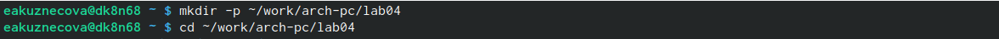{#fig:001 width=80%}

Создаю в текущем каталоге текстовый файл hello.asm с помощью улитилы touch и открываю созданный файл в текстовом редакторе gedit (рис. [-@fig:002]).

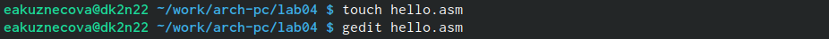{#fig:002 width=80%}

Заполняю файл, вставляя в него программу (рис. [-@fig:003]).

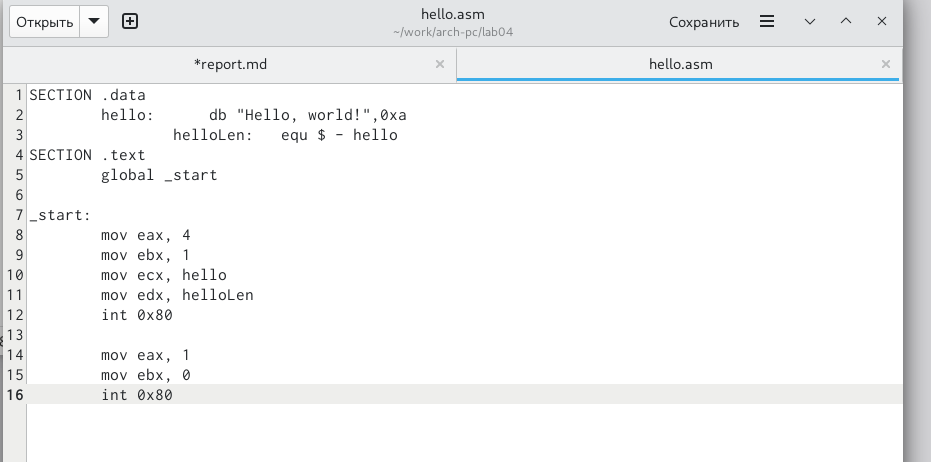{#fig:003 width=80%}

Превращаю текст программы в объектный код с помощью транслятора NASM, используя команду nasm -f elf hello.asm. Далее проверяю правильность выполнения команды с помощью команды ls (рис. [-@fig:004]).

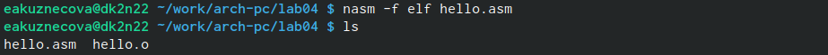{#fig:004 width=80%}

Использую команду, которая скомпилирует исходный файл hello.asm в obj.o, при этом формат выходного файла будет elf и в него будут включены символы для отладки (ключ -g), кроме того, будет создан файл листинга list.lst.Далее с помощью команды ls проверяю, что файлы были созданы (рис. [-@fig:005]).

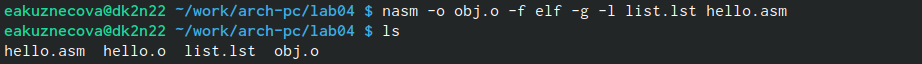{#fig:005 width=80%}

Передаю объектный файл hello.o на обработку компоновщику LD, чтобы получить исполняемый файл hello. Далее проверяю с помощью команды ls правильность выполнения команды (рис. [-@fig:006]). 

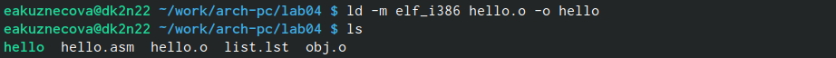{#fig:006 width=80%}

Использую команду, которая позволяет исполняемому файлу иметь имя main, потому что с помощью ключа -o было создано значение main. Объектный файл будет иметь имя obj.o (рис. [-@fig:007]).

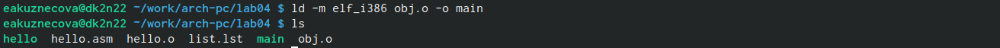{#fig:007 width=80%}

Запускаю на выполнение созданный исполняемый файл hello (рис. [-@fig:008]).

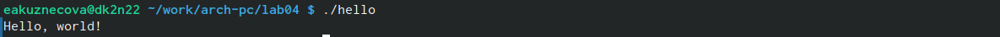{#fig:008 width=80%}

# Выполнение заданий для самостоятельной работы

С помощью команды cp создаю в текущем каталоге копию файла hello.asm с именем lab4.asm (рис. [-@fig:009]).

{#fig:009 width=80%}

С помощью текстового редактора gedit открываю файл lab4.asm, вношу измения в программу, чтобы она выводила мои имя и фамилию (рис. [-@fig:010]).

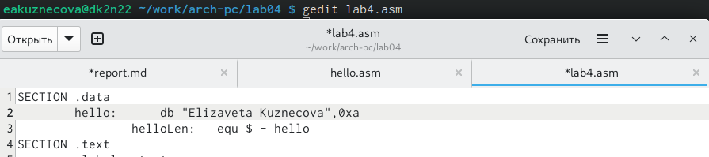{#fig:010 width=80%}

Компилирую текст программы в объектный файл. Проверяю с помощью команды ls, что файл lab4.o создан (рис. [-@fig:011]).

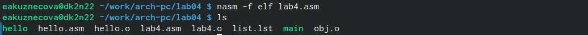{#fig:011 width=80%}

Передаю объектный файл lab4.o на обработку компоновшику LD, чтобы получить исполняемый файл lab4 (рис. [-@fig:012]).

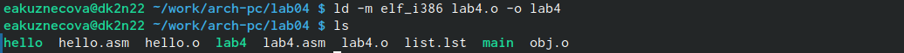{#fig:012 width=80%}

Запускаю исполняемый файл lab4 (рис. [-@fig:013]).

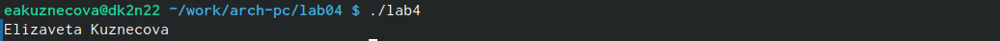{#fig:013 width=80%}

Копирую файлы hello.asm и lab4.asm в свой локальный репозиторий в каталог ~/work/study/2023-2024/"Архитектура компьютера"/arch-pc/labs/lab04/. Перехожу в этот каталог и проверяю наличие файлов в нем (рис. [-@fig:014]).

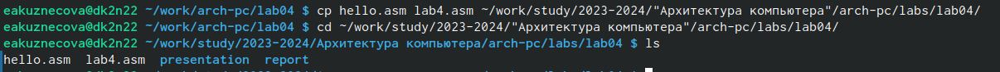{#fig:014 width=80%}

С помощью команд git add . и git commit добавляю файлы на GitHub (рис. [-@fig:015]).

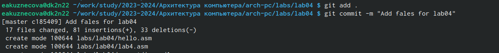{#fig:015 width=80%}

Отправляю файлы на сервер с помощью команды git push (рис. [-@fig:016]).

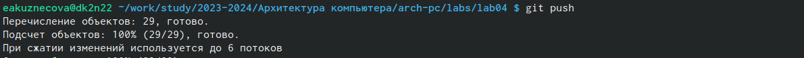{#fig:016 width=80%}

# Выводы

Я освоила процедуры компиляции и сборки программ, написанных на ассемблере NASM.

