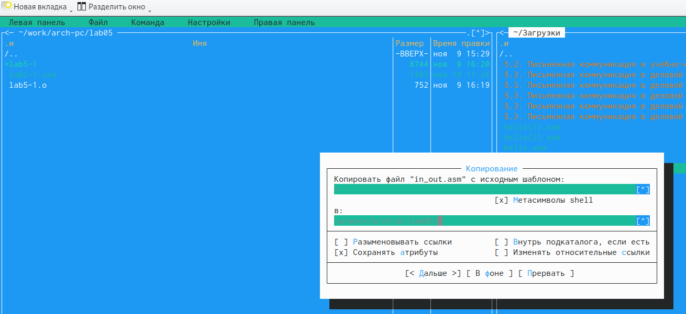

---
## Front matter
title: "Отчет по лабораторной работе №5"
subtitle: "Дисциплина: архитектура компьютера"
author: "Кузнецова Елизавета Андреевна"

## Generic otions
lang: ru-RU
toc-title: "Содержание"

## Bibliography
bibliography: bib/cite.bib
csl: pandoc/csl/gost-r-7-0-5-2008-numeric.csl

## Pdf output format
toc: true # Table of contents
toc-depth: 2
lof: true # List of figures
lot: true # List of tables
fontsize: 12pt
linestretch: 1.5
papersize: a4
documentclass: scrreprt
## I18n polyglossia
polyglossia-lang:
  name: russian
  options:
	- spelling=modern
	- babelshorthands=true
polyglossia-otherlangs:
  name: english
## I18n babel
babel-lang: russian
babel-otherlangs: english
## Fonts
mainfont: PT Serif
romanfont: PT Serif
sansfont: PT Sans
monofont: PT Mono
mainfontoptions: Ligatures=TeX
romanfontoptions: Ligatures=TeX
sansfontoptions: Ligatures=TeX,Scale=MatchLowercase
monofontoptions: Scale=MatchLowercase,Scale=0.9
## Biblatex
biblatex: true
biblio-style: "gost-numeric"
biblatexoptions:
  - parentracker=true
  - backend=biber
  - hyperref=auto
  - language=auto
  - autolang=other*
  - citestyle=gost-numeric
## Pandoc-crossref LaTeX customization
figureTitle: "Рис."
tableTitle: "Таблица"
listingTitle: "Листинг"
lofTitle: "Список иллюстраций"
lotTitle: "Список таблиц"
lolTitle: "Листинги"
## Misc options
indent: true
header-includes:
  - \usepackage{indentfirst}
  - \usepackage{float} # keep figures where there are in the text
  - \floatplacement{figure}{H} # keep figures where there are in the text
---

# Цель работы

Целью работы является приобретение практических навыков работы в Midnight Commander, освоение инструкций языка ассемблера mov и int.

# Задание

1. Освоить работу с mc.
2. Изучить структуру программы на языке ассемблера NASM.
3. Подключить внешний файл.
4. Выполнить задания для лабораторной работы.
5. Загрузить отчет с выполненной лабораторной работой на Github.

# Теоретическое введение

Midnight Commander (или просто mc) — это программа, которая позволяет просматривать
структуру каталогов и выполнять основные операции по управлению файловой системой,
т.е. mc является файловым менеджером. Midnight Commander позволяет сделать работу с
файлами более удобной и наглядной.
Для активации оболочки Midnight Commander достаточно ввести в командной строке mc и
нажать клавишу Enter.
В Midnight Commander используются функциональные клавиши F1 — F10 , к которым
привязаны часто выполняемые операции.
Программа на языке ассемблера NASM, как правило, состоит из трёх секций: секция кода
программы (SECTION .text), секция инициированных (известных во время компиляции)
данных (SECTION .data) и секция неинициализированных данных (тех, под которые во
время компиляции только отводится память, а значение присваивается в ходе выполнения
программы) (SECTION .bss).

# Выполнение лабораторной работы

Открыла Midnight Commander с помощью команды mc (рис. [-@fig:001]).

{#fig:001 width=80%}

Перешла в каталог ~/work/arch-pc (рис. [-@fig:002]).

{#fig:002 width=80%}

С помощью функциональной клавиши F7 создаю каталог lab05 (рис. [-@fig:003]).

{#fig:003 width=80%}

Перешла в созданный каталог и прописала в строке ввода команду touch lab5-1.asm, чтобы создать файл, который будет использоваться для работы (рис. [-@fig:004]).

{#fig:004 width=80%}

Открыла файл lab5-1.asm для редактирования во встроенном редакторе nano и вставила в него программу. Далее вышла из файла и сохранила изменения (рис. [-@fig:005]).

{#fig:005 width=80%}

Открыла файл lab5-1.asm с помощью клавиши F3 для просмотра, чтобы убедиться в том, что  текст содержится в файле (рис. [-@fig:006]).

{#fig:006 width=80%}

Создала объектный файл lab5-1.o, выполнила компоновку объектного файла с помощью команды ld -m elf_i386 -o lab5-1 lab5-1.o.Создался исполняемый файл, запустила этот файл (рис. [-@fig:007]).

{#fig:007 width=80%}

Скачала файл in_out.asm, с помощью функциональной клавиши F5 скопировала этот файл из директории Загрузки в созданную ранее директорию lab05 (рис. [-@fig:008]).

{#fig:008 width=80%}

С помощью функциональной клавиши F5 скопировала файл lab5-1.asm в этот же каталог, в котором он был, но с новым именем lab5-2.asm (рис. [-@fig:009]).

{#fig:009 width=80%}

Изменила содержимое файла lab5-2.asm во встроенном редакторе nano, чтобы в программе использовались подпограммы из внешнего файла in_out.asm (рис. [-@fig:010]).

{#fig:010 width=80%}

Создала объектный файл lab5-2.o, выполнила компоновку объктного файла с помощью команды ld -m elf_i386 -o lab5-2 lab5-2.o.Создался исполняемый файл, запустила этот файл (рис. [-@fig:011]).

{#fig:011 width=80%}

В тексте программы lab5-2.asm заменила sprintLF на sprint (рис. [-@fig:012]).

{#fig:012 width=80%}

Создала объектный файл lab5-2.o, выполнила компоновку объктного файла с помощью команды ld -m elf_i386 -o lab5-2 lab5-2.o.Создался исполняемый файл, запустила этот файл. Теперь ввод производится на той же строке, что и вывод, убран символ перевода строки после вывода (рис. [-@fig:013]).

{#fig:013 width=80%}

# Выполнение заданий для самостоятельной работы

С помощью функциональной клавиши F5 скопировала файл lab5-1.asm в этот же каталог, в котором он был, но с новым именем lab5-3.asm (рис. [-@fig:014]).

{#fig:014 width=80%}

Изменила код программы, добавила вывод введенной строки (рис. [-@fig:015]).

{#fig:015 width=80%}

Создала объектный файл lab5-3.o, выполнила компоновку объктного файла с помощью команды ld -m elf_i386 -o lab5-3 lab5-3.o.Создался исполняемый файл, запустила этот файл (рис. [-@fig:016]).

{#fig:016 width=80%}

**Программа, которую я использовала для выполнения 1 пункта самостоятельной работы:**

```NASM

  SECTION .data
  msg:  DB 'Введите строку:',10

  msgLen:  EQU $-msg

  SECTION  .bss
  buf1:     RESB 80

   SECTION .text
   GLOBAL _start
    _start:


    mov eax,4
    mov ebx,1
    mov ecx,msg
    mov edx,msgLen
    int 80h

    mov eax, 3
    mov ebx, 0
    mov ecx, buf1
    mov edx, 80
    int 80h

    mov eax, 4
    mov ebx, 1
    mov ecx, buf1
    mov edx, buf1
    int 80h

    mov eax, 1
    mov edx, 0
    int 80h
```
С помощью функциональной клавиши F5 скопировала файл lab5-2.asm в этот же каталог, в котором он был, но с новым именем lab5-4.asm (рис. [-@fig:017]).

{#fig:017 width=80%}

Изменила код программы, добавила вывод введенной строки (рис. [-@fig:018]).

{#fig:018 width=80%}

Создала объектный файл lab5-4.o, выполнила компоновку объктного файла с помощью команды ld -m elf_i386 -o lab5-4 lab5-4.o.Создался исполняемый файл, запустила этот файл (рис. [-@fig:019]).

{#fig:019 width=80%}

**Программа, которую я использовала для выполнения 3 пункта самостоятельной работы:**

```NASM

;------------------------------------------------------------------
; Программа вывода сообщения на экран и ввода строки с клавиатуры
;------------------------------------------------------------------

%include 'in_out.asm'

SECTION .data
msg:  DB 'Введите строку: ',0h

SECTION  .bss
buf1:  RESB 80

SECTION .text
   GLOBAL _start
   _start:

   mov   eax, msg
   call  sprint

   mov   ecx, buf1
   mov   edx, 80

   call  sread
   mov   eax, 4
   mov   ebx, 1
   mov   ecx, buf1
   int   80h

   call  quit
```
# Выводы

В ходе этой лабораторной работы я приобрела практические навыки работы в Midnight Commander, а также освоила инструкции языка ассемблера mov и int
