---
## Front matter
title: "Отчёт по лабораторной работе №6"
subtitle: "Дисциплина: архитектура компьютера"
author: "Кузнецова Елизавета Андреевна"

## Generic otions
lang: ru-RU
toc-title: "Содержание"

## Bibliography
bibliography: bib/cite.bib
csl: pandoc/csl/gost-r-7-0-5-2008-numeric.csl

## Pdf output format
toc: true # Table of contents
toc-depth: 2
lof: true # List of figures
lot: true # List of tables
fontsize: 12pt
linestretch: 1.5
papersize: a4
documentclass: scrreprt
## I18n polyglossia
polyglossia-lang:
  name: russian
  options:
	- spelling=modern
	- babelshorthands=true
polyglossia-otherlangs:
  name: english
## I18n babel
babel-lang: russian
babel-otherlangs: english
## Fonts
mainfont: PT Serif
romanfont: PT Serif
sansfont: PT Sans
monofont: PT Mono
mainfontoptions: Ligatures=TeX
romanfontoptions: Ligatures=TeX
sansfontoptions: Ligatures=TeX,Scale=MatchLowercase
monofontoptions: Scale=MatchLowercase,Scale=0.9
## Biblatex
biblatex: true
biblio-style: "gost-numeric"
biblatexoptions:
  - parentracker=true
  - backend=biber
  - hyperref=auto
  - language=auto
  - autolang=other*
  - citestyle=gost-numeric
## Pandoc-crossref LaTeX customization
figureTitle: "Рис."
tableTitle: "Таблица"
listingTitle: "Листинг"
lofTitle: "Список иллюстраций"
lotTitle: "Список таблиц"
lolTitle: "Листинги"
## Misc options
indent: true
header-includes:
  - \usepackage{indentfirst}
  - \usepackage{float} # keep figures where there are in the text
  - \floatplacement{figure}{H} # keep figures where there are in the text
---

# Цель работы

Цель лабораторной работы - освоение арифметических инструкций языка ассемблера NASM.

# Задание

1. Освоить символьные и численные данные в NASM.
2. Выполнить арифметические операции в NASM.
3. Написать программу вычисления выражения 𝑦 = 𝑓(𝑥). Вариант узнать по программе для студенчекого билета.
4. Загрузить файлы на Github.

# Теоретическое введение

Большинство инструкций на языке ассемблера требуют обработки операндов. Адрес опе-
ранда предоставляет место, где хранятся данные, подлежащие обработке. Это могут быть
данные хранящиеся в регистре или в ячейке памяти. Далее рассмотрены все существующие
способы задания адреса хранения операндов – способы адресации.
Существует три основных способа адресации:
Регистровая адресация – операнды хранятся в регистрах и в команде используются
имена этих регистров, например: mov ax,bx. Непосредственная адресация – значение операнда задается непосредственно в команде, Например: mov ax,2. Адресация памяти – операнд задает адрес в памяти. В команде указывается символическое обозначение ячейки памяти, над содержимым которой требуется выполнить операцию.
Ввод информации с клавиатуры и вывод её на экран осуществляется в символьном виде.
Кодирование этой информации производится согласно кодовой таблице символов ASCII.
ASCII – сокращение от American Standard Code for Information Interchange (Американский
стандартный код для обмена информацией). Согласно стандарту ASCII каждый символ
кодируется одним байтом.Расширенная таблица ASCII состоит из двух частей. Первая (символы с кодами 0-127) является универсальной, а вторая (коды 128-255) предназначена для
специальных символов и букв национальных алфавитов и на компьютерах разных типов
может меняться.Среди инструкций NASM нет такой, которая выводит числа (не в символьном виде). Поэтому, например, чтобы вывести число, надо предварительно преобразовать его цифры в
ASCII-коды этих цифр и выводить на экран эти коды, а не само число. Если же выводить число
на экран непосредственно, то экран воспримет его не как число, а как последовательность
ASCII-символов – каждый байт числа будет воспринят как один ASCII-символ – и выведет на
экран эти символы.
Аналогичная ситуация происходит и при вводе данных с клавиатуры. Введенные дан-
ные будут представлять собой символы, что сделает невозможным получение корректного
результата при выполнении над ними арифметических операций.
Для решения этой проблемы необходимо проводить преобразование ASCII символов в
числа и обратно.

# Выполнение лабораторной работы

С помощью утилиты mkdir создала директорию, в которой буду создавать файлы с программами для лабораторной работы. Перешла в созданный каталог с помощью утилиты cd (рис. [-@fig:001]).

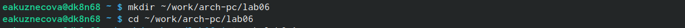{#fig:001 width=80%}

С помощью утилиты touch создала файл lab6-1.asm (рис. [-@fig:002]).

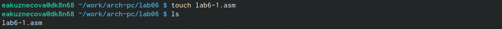{#fig:002 width=80%}

Скопировала в текущий каталог файл in_out.asm с помощью утилиты cp, так как он будет использоваться в других программах (рис. [-@fig:003]).

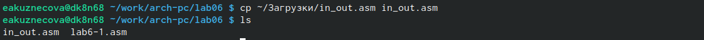{#fig:003 width=80%}

Открыла созданный файл lab6-1.asm, вставила в него программу вывода значения регистра eax 
(рис. [-@fig:004]).

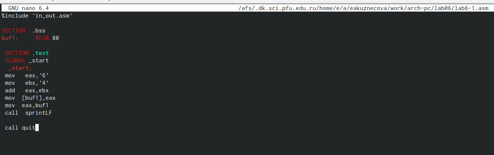{#fig:004 width=80%}

Создала исполняемый файл программы и запустила его. Вывелся символ j, потому что программа вывела символ, соответсвующий по система ASCII сумме двоичных кодов и символов 4 и 6 (рис. [-@fig:005]).

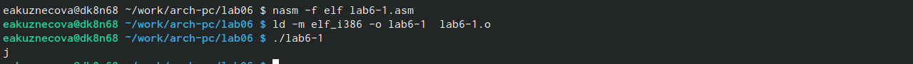{#fig:005 width=80%}

Изменила в тексте программы символы "6" и "4" на цифры 6 и 4 (рис. [-@fig:006]).

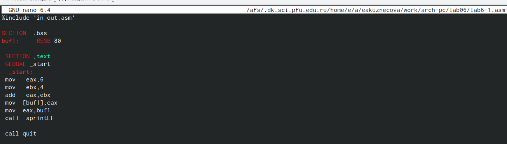{#fig:006 width=80%}

Создала новый исполняемый файл программы и запустила его. Теперь вывелся символ с кодом 10, это символ перевода строки, он не отображается при выводе на экран (рис. [-@fig:007]).

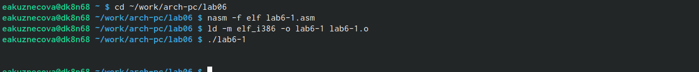{#fig:007 width=80%}

Создала новый файл lab6-2.asm с помощью утилиты touch (рис. [-@fig:008]).

{#fig:008 width=80%}

Ввела в файл текст другой программы для вывода значения регистра eax (рис. [-@fig:009]).

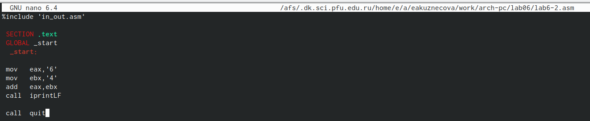{#fig:009 width=80%}

Создала исполняемый файл lab6-2.asm и запустила его. Теперь вывелось число 106, потому что программа позволяет вывести именно число, а не символ, но все равно происходит именно сложение кодов символов "6" и "4"(рис. [-@fig:010]).

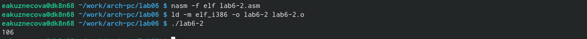{#fig:010 width=80%}

Заменила в тексте программы в файле lab6-2.asm символы "6" и "4" на цифры 6 и 4 (рис. [-@fig:011]).

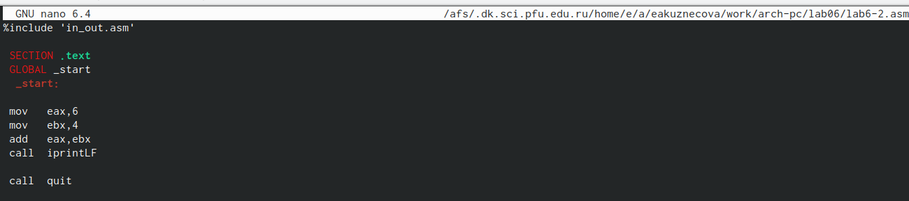{#fig:011 width=80%}

Создала новый исполняемый и запустила его. Теперь программа скложила не соответствующие символам коды в системе ASCII, а цифры, поэтому вывод 10 (рис. [-@fig:012]).

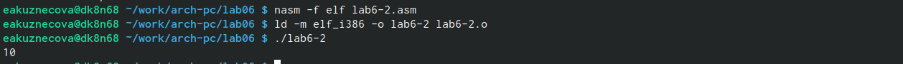{#fig:012 width=80%}

Заменила в тексте программы iprintLF на iprint (рис. [-@fig:013]).

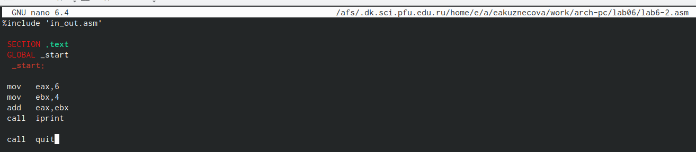{#fig:013 width=80%}

Создала новый исполняемый файл и запусила его. Выводилась также сумма цифр 6 и 4, потому что символ переноса строки не отоброжался, когда программа исполнялась с функцией iprintLF, а iprint не добавляет к выводу символ переноса строки в отличие от iprintLF (рис. [-@fig:014]). 

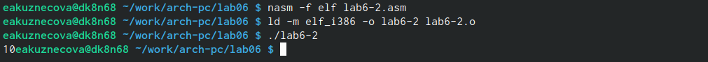{#fig:014 width=80%}

Создала файл lab6-3.asm c помощью утилиты touch (рис. [-@fig:015]).

{#fig:015 width=80%}

Ввела в созданный файл текст программы для вычисления значения выражения f(x) = (5 * 2 + 3)/3 
(рис. [-@fig:016]).

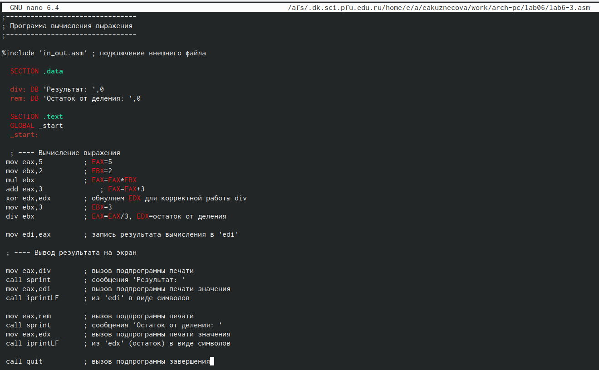{#fig:016 width=80%}

Создала исполняемый файл и запустила его (рис. [-@fig:017]).

{#fig:017 width=80%}

Изменила программу, чтобы она вычисляла значение выражения f(x) = (4 * 6 + 2)/5 (рис. [-@fig:018]).

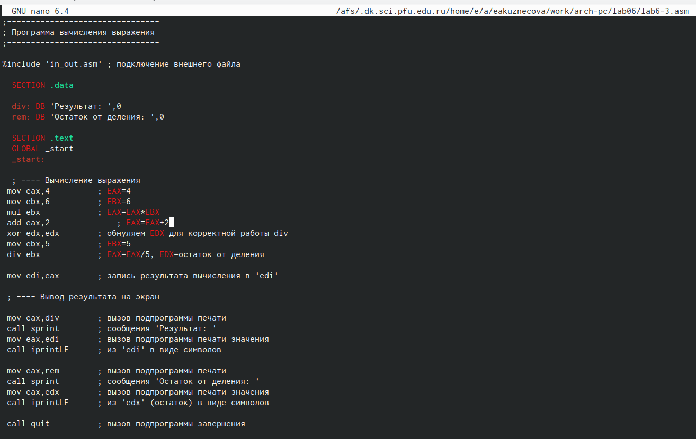{#fig:018 width=80%}

Создала новый исполняемый файл и запустила его. Программа правильно была выполнена, я пеерепроверяла самостоятельно (рис. [-@fig:019]).

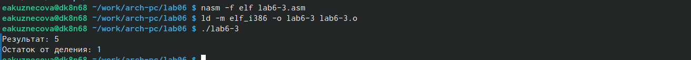{#fig:019 width=80%}

Создала файл variant.asm с помощью утилиты touch (рис. [-@fig:020]).

{#fig:020 width=80%}

Ввела в созданный файл текст программы для вычисления варианта задания по номеру студенческого билета (рис. [-@fig:021]).

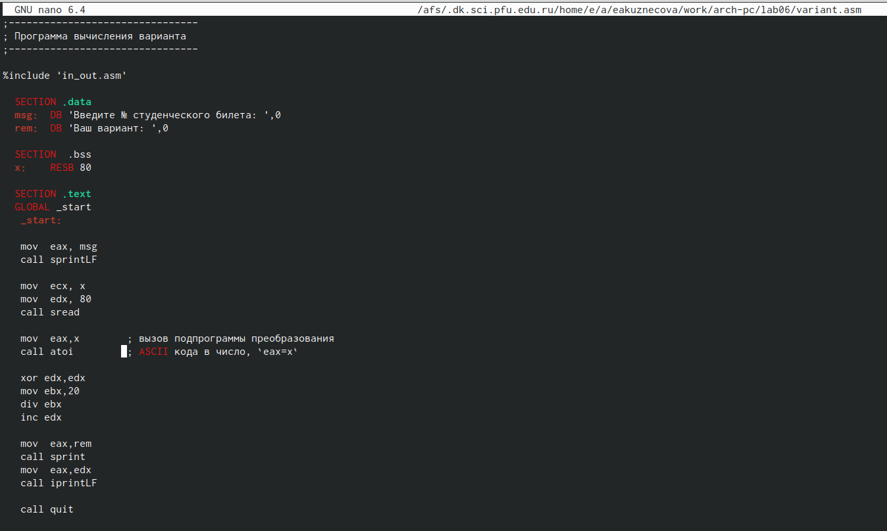{#fig:021 width=80%}

Создала новый исполняемый файл и запустила его. Ввела номер своего студенческого билета с клавиатуры, программа вывела, что мой вариант-20 (рис. [-@fig:022]).

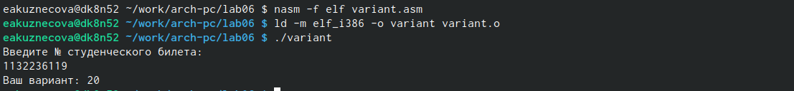{#fig:022 width=80%}
                                                                                                                                                              
# Ответы на вопросы по программе 

1. За вывод сообщения “Ваш вариант” отвечают строки кода:
```NASM
mov eax,rem
call sprint
```
2. Инструкция mov ecx, x используется, чтобы положить адрес вводимой строки x в регистр ecx mov edx, 80 - запись в регистр edx длины вводимой строки call sread - вызов подпрограммы из внешнего файла, обеспечивающей ввод сообщения с клавиатуры.
3. call atoi используется для вызова подпрограммы из внешнего файла, которая преобразует ascii-код символа в целое число и записывает результат в регистр eax.
4. За вычисления варианта отвечают строки:
``` NASM
xor edx,edx 
mov ebx,20 
div ebx 
inc edx 
```
5. При выполнении инструкции div ebx остаток от деления записывается в регистр edx.
6. Инструкция inc edx увеличивает значение регистра edx на 1.
7. За вывод на экран результатов вычислений отвечают строки:
```NASM
mov eax,edx
call iprintLF
```

# Выполнение заданий для самостоятельной работы 

Создала файл lab6-4.asm с помощью утилиты touch (рис. [-@fig:023]).

{#fig:023 width=80%}

Открыла созданный фвйл и ввела в него текст программы для вычисления значения выражения 𝑥^3*1/3+21, которое было под 20 вариантом (рис. [-@fig:024]).

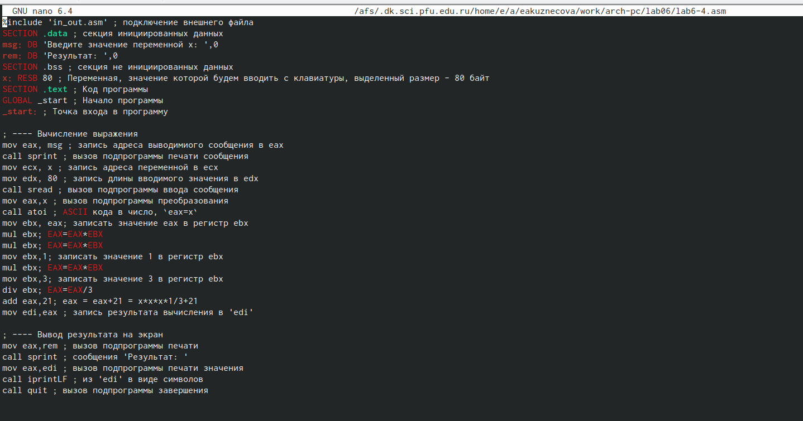{#fig:024 width=80%}

Создала новый исполняемый файл и запустила его. При вводе значения 1, выводом является число 21. При вводе значения 3, выводом является число 30. Программа сработала верно, я проверяла самостоятельно (рис. [-@fig:025]).

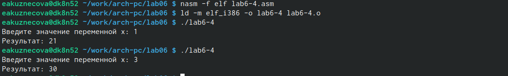{#fig:025 width=80%}

# Программа для вычисления значения выражения x^3*1/3+21
```NASM
%include 'in_out.asm' ; подключение внешнего файла
SECTION .data ; секция инициированных данных
msg: DB 'Введите значение переменной х: ',0
rem: DB 'Результат: ',0
SECTION .bss ; секция не инициированных данных
x: RESB 80 ; Переменная, значение которой будем вводить с клавиатуры, выделенный размер - 80 байт
SECTION .text ; Код программы
GLOBAL _start ; Начало программы
_start: ; Точка входа в программу

; ---- Вычисление выражения
mov eax, msg ; запись адреса выводимиого сообщения в eax
call sprint ; вызов подпрограммы печати сообщения
mov ecx, x ; запись адреса переменной в ecx
mov edx, 80 ; запись длины вводимого значения в edx
call sread ; вызов подпрограммы ввода сообщения
mov eax,x ; вызов подпрограммы преобразования
call atoi ; ASCII кода в число, `eax=x`
mov ebx, eax; записать значение eax в регистр ebx
mul ebx; EAX=EAX*EBX
mul ebx; EAX=EAX*EBX
mov ebx,1; записать значение 1 в регистр ebx
mul ebx; EAX=EAX*EBX
mov ebx,3; записать значение 3 в регистр ebx
div ebx; EAX=EAX/3
add eax,21; eax = eax+21 = x*x*x*1/3+21
mov edi,eax ; запись результата вычисления в 'edi'

; ---- Вывод результата на экран
mov eax,rem ; вызов подпрограммы печати
call sprint ; сообщения 'Результат: '
mov eax,edi ; вызов подпрограммы печати значения
call iprintLF ; из 'edi' в виде символов
call quit ; вызов подпрограммы завершения
```

# Выводы

При выполнении данной лабораторной работы я освоила арифметические инструкции языка ассемблера NASM.

