---
## Front matter
title: "Отчёт по лабораторной работе №7"
subtitle: "Дисциплина: архитектура компьютера"
author: "Кузнецова Елизавета Андреевна"

## Generic otions
lang: ru-RU
toc-title: "Содержание"

## Bibliography
bibliography: bib/cite.bib
csl: pandoc/csl/gost-r-7-0-5-2008-numeric.csl

## Pdf output format
toc: true # Table of contents
toc-depth: 2
lof: true # List of figures
lot: true # List of tables
fontsize: 12pt
linestretch: 1.5
papersize: a4
documentclass: scrreprt
## I18n polyglossia
polyglossia-lang:
  name: russian
  options:
	- spelling=modern
	- babelshorthands=true
polyglossia-otherlangs:
  name: english
## I18n babel
babel-lang: russian
babel-otherlangs: english
## Fonts
mainfont: PT Serif
romanfont: PT Serif
sansfont: PT Sans
monofont: PT Mono
mainfontoptions: Ligatures=TeX
romanfontoptions: Ligatures=TeX
sansfontoptions: Ligatures=TeX,Scale=MatchLowercase
monofontoptions: Scale=MatchLowercase,Scale=0.9
## Biblatex
biblatex: true
biblio-style: "gost-numeric"
biblatexoptions:
  - parentracker=true
  - backend=biber
  - hyperref=auto
  - language=auto
  - autolang=other*
  - citestyle=gost-numeric
## Pandoc-crossref LaTeX customization
figureTitle: "Рис."
tableTitle: "Таблица"
listingTitle: "Листинг"
lofTitle: "Список иллюстраций"
lotTitle: "Список таблиц"
lolTitle: "Листинги"
## Misc options
indent: true
header-includes:
  - \usepackage{indentfirst}
  - \usepackage{float} # keep figures where there are in the text
  - \floatplacement{figure}{H} # keep figures where there are in the text
---

# Цель работы

Изучить команды условного и безусловного переходов и научиться писать программы с использованием этих переходов.

# Задание

1. Ознакомиться с листингами, проделать с ними изменения.
2. Выполнить задания для самостоятельной работы.
3. Загрузить файлы на Github.

# Теоретическое введение

Для реализации ветвлений в ассемблере используются так называемые команды передачи
управления или команды перехода. Можно выделить 2 типа переходов: условный переход – выполнение или не выполнение перехода в определенную точку программы в зависимости от проверки условия; безусловный переход – выполнение передачи управления в определенную точку программы без каких-либо условий.
Безусловный переход выполняется инструкцией jmp (от англ. jump – прыжок), которая
включает в себя адрес перехода, куда следует передать управление.
Для условного перехода необходима проверка какого-либо условия. В ассемблере команды условного перехода вычисляют условие перехода анализируя флаги из регистра флагов.

# Выполнение лабораторной работы

С помощью утилиты mkdir создала директорию, в которой буду создавать файлы с программами для лабораторной работы. Перешла в созданный каталог с помощью утилиты cd (рис. [-@fig:001]).

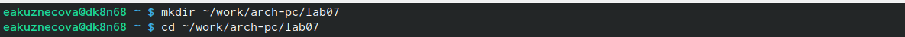{#fig:001 width=80%}

С помощью утилиты touch создала файл lab7-1.asm (рис. [-@fig:002]).

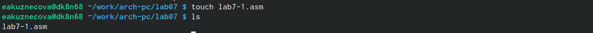{#fig:002 width=80%}

Скопировала в текущий каталог файл in_out.asm с помощью утилиты cp, так как он будет использоваться в других программах (рис. [-@fig:003]).

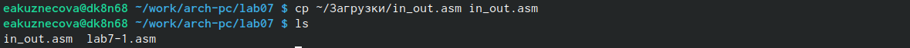{#fig:003 width=80%}

Открыла созданный файл lab7-1.asm, вставила в него программу (программа с использованием иснтрукции jmp) (рис. [-@fig:004]).

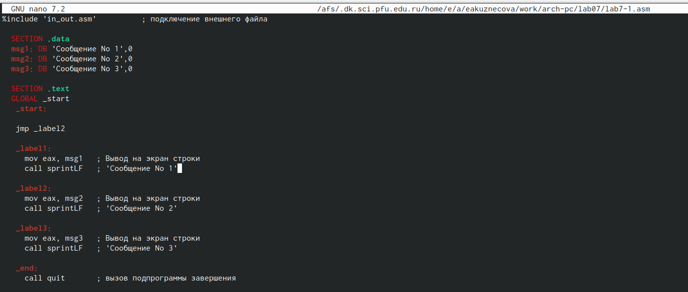{#fig:004 width=80%}

Создала исполняемый файл программы и запустила его. Результат данной программы являлся правильным (рис. [-@fig:005]).

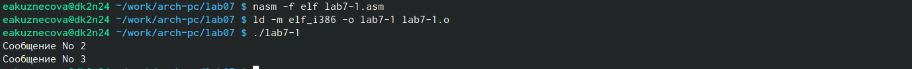{#fig:005 width=80%}

Добавила в текст программы после вывода сообщения № 2 инструкцию jmp с меткой _label1 и и после вывода сообщения № 1 добавила инструкцию jmp с меткой _end (рис. [-@fig:006]).

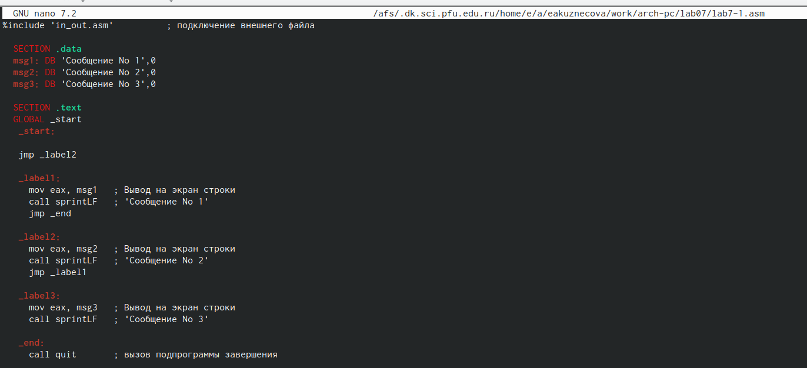{#fig:006 width=80%}

Создала новый исполняемый файл программы и запустила его. Результат данной программы являлся правильным (рис. [-@fig:007]).

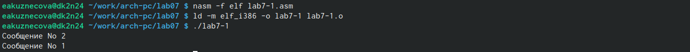{#fig:007 width=80%}

Добавила в текст программы после вывода сообщения № 3 инструкцию jmp с меткой _label2, также использовала инструкцию jmp _label3 (рис. [-@fig:008]).

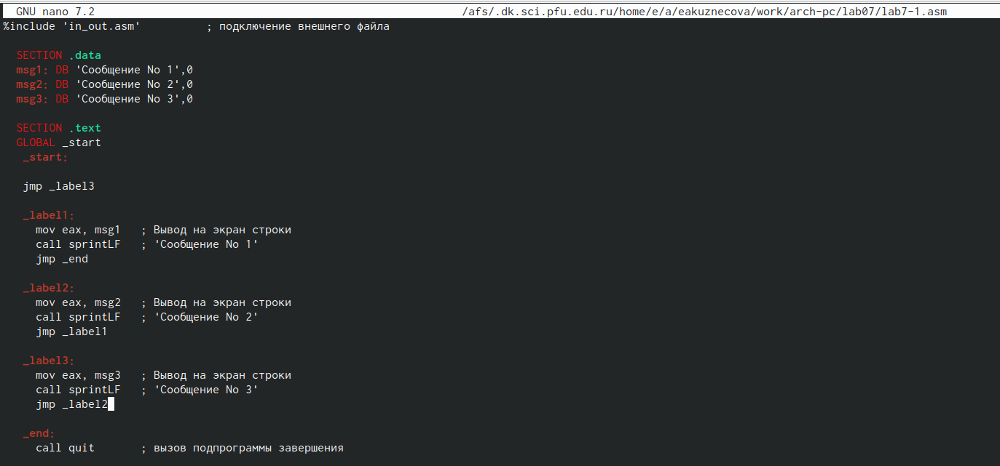{#fig:008 width=80%}

Создала новый исполняемый файл программы и запустила его. Результат данной программы являлся правильным (рис. [-@fig:009]).

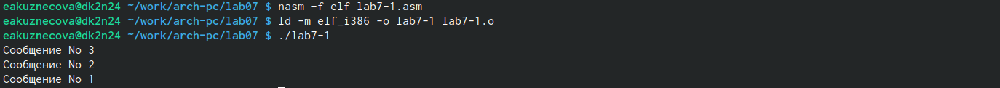{#fig:009 width=80%}

С помощью утилиты touch создала файл lab7-2.asm (рис. [-@fig:010]).

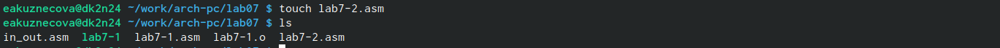{#fig:010 width=80%}

Открыла созданный файл lab7-2.asm, вставила в него программу, которая определяет и выводит на экран наибольшую из 3 целочисленных переменных: A,B и C (рис. [-@fig:011]).

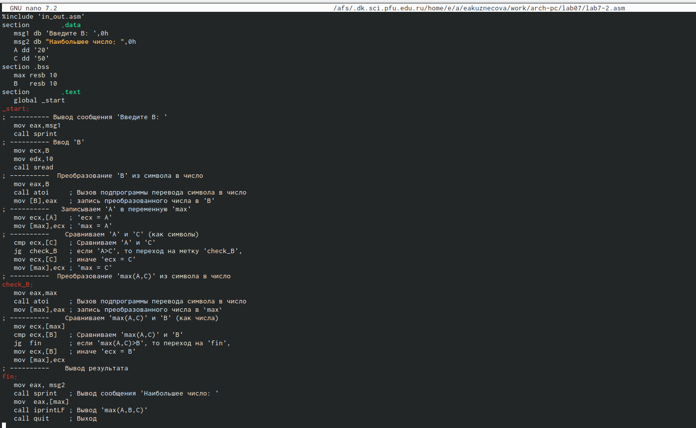{#fig:011 width=80%}

Создала новый исполняемый файл программы и запустила его. Результаты данной программы выводились правильно (рис. [-@fig:012]).

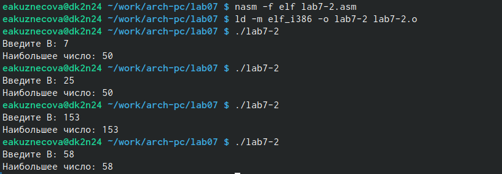{#fig:012 width=80%}

Создала файл листинга для программы из файла lab7-2.asm и открыла его с помощью с помощью текстового редактора mcedit (рис. [-@fig:013]).

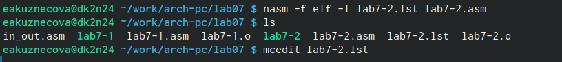{#fig:013 width=80%}

После открытия файла ознакомилась с ним и объяснила содержимое трёх строк файла. В строке номер 10 содержится номер строки [10], адрес [00000008], машинный код [40], содержимое строки кода [inc eax]. В строке номер 23 содержится номер строки [23], адрес [0000000F], машинный код [52], содержимое строки кода [push edx]. В строке номер 35 содержится номер строки [35], адрес [00000027], машинный код [35], содержимое строки кода [int 80h] (рис. [-@fig:014]).

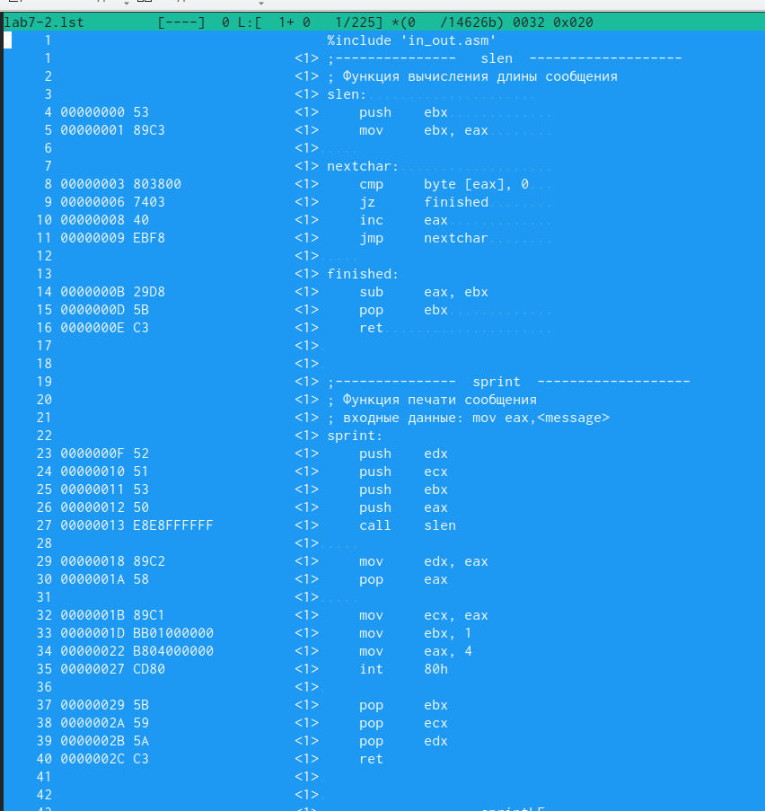{#fig:014 width=80%}

Окрыла файл с программой lab7-2.asm и в инструкции с двумя операндами удалила один операнд (было: mov eax,msg1; стало: mov eax) (рис. [-@fig:015]).

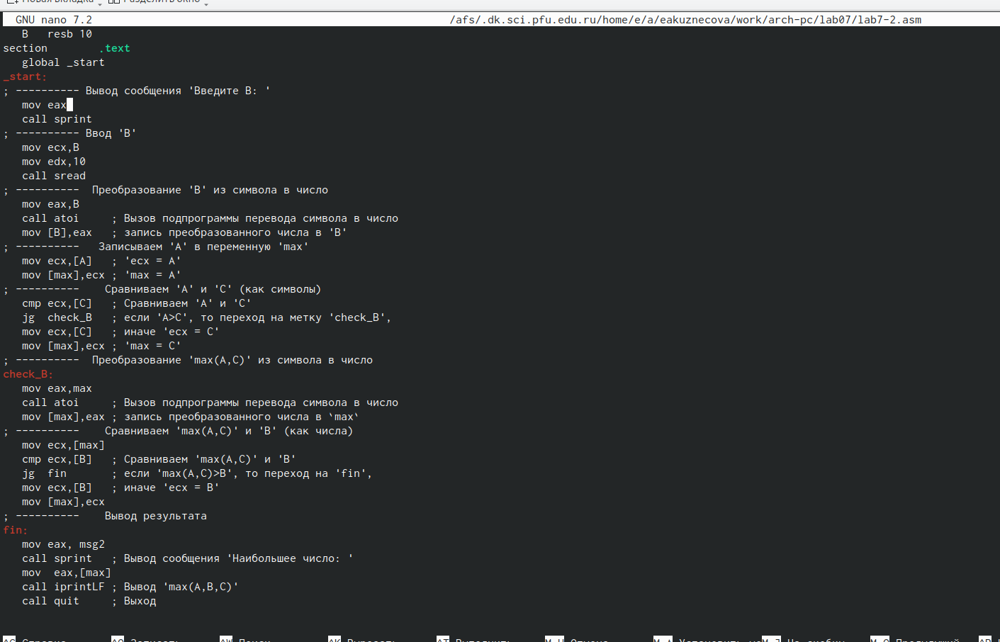{#fig:015 width=80%}

Выполнила трансляцию с получением файла листинга. Вывелась ошибка (рис. [-@fig:016]).

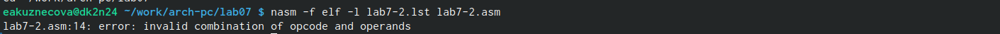{#fig:016 width=80%}

Открыла файл листинга для программы из файла lab7-2.asm. Если в коде появляется ошибка, то ее описание появится в файле листинга (рис. [-@fig:017]).

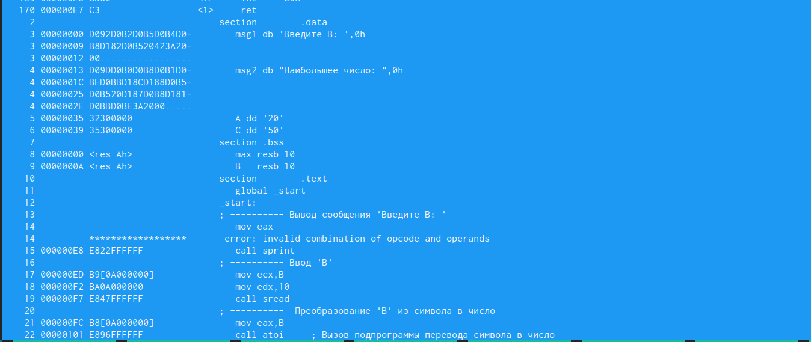{#fig:017 width=80%}

# Выполнение заданий для самостоятельной работы 

С помощью утилиты touch создала файл lab7-3.asm (рис. [-@fig:018]).

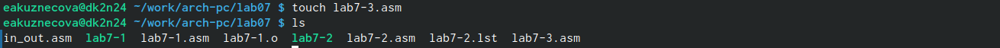{#fig:018 width=80%}

Открыла созданный файл lab7-3.asm, написала программу нахождение нименьшей из 3 целочисленных переменных. Выбрала значения переменных 20 варианта, полученным при выполнении лабораторной работы № 6 (рис. [-@fig:019]). 

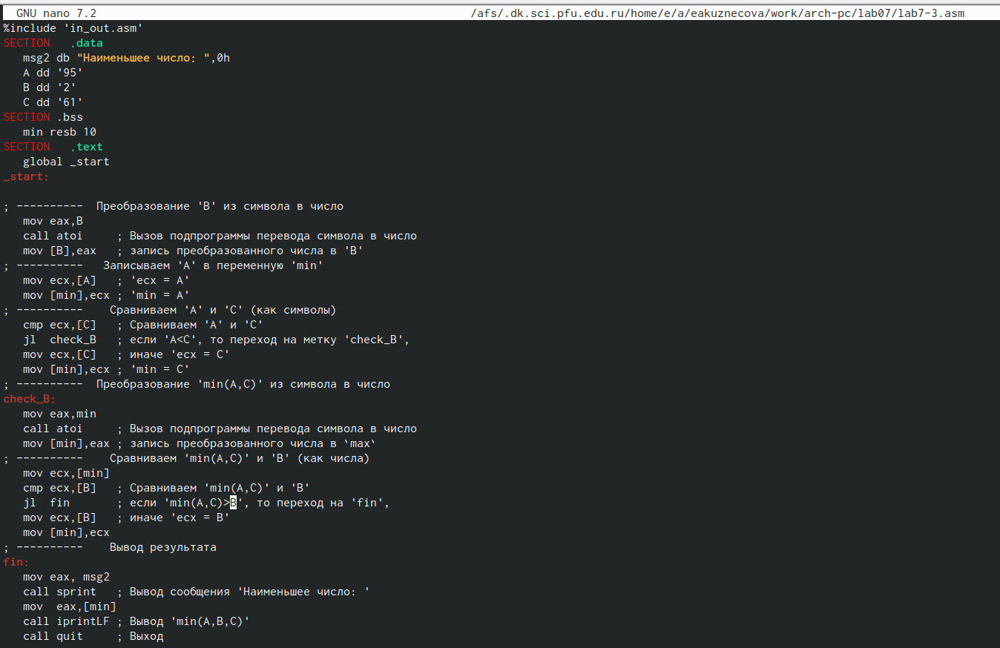{#fig:019 width=80%}

Создала новый исполняемый файл программы и запустила его. Результат данной программы вывелся правильно (рис. [-@fig:020]).

{#fig:020 width=80%}

С помощью утилиты touch создала файл lab7-4.asm (рис. [-@fig:021]).

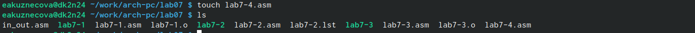{#fig:021 width=80%}

Открыла созданный файл lab7-4.asm, написала программу, которая для введенных с клавиатуры значений 𝑥 и 𝑎 вычисляет значение заданной функции 𝑓(𝑥) и выводит результат вычислений. Выбрала значения переменных 20 варианта, полученным при выполнении лабораторной работы № 6 (рис. [-@fig:022]). 

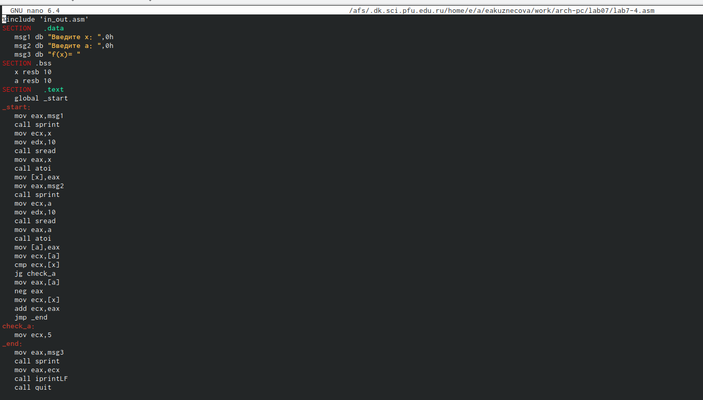{#fig:022 width=80%}

Создала новый исполняемый файл программы и запустила его. Результат данной программы вывелся правильно (рис. [-@fig:023]).

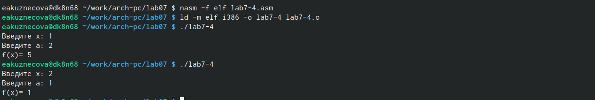{#fig:023 width=80%}

**Программу, которую я использовала для выполнения 1 пункта самостоятельной работы:**

```NASM

%include 'in_out.asm'
SECTION   .data
   msg2 db "Наименьшее число: ",0h
   A dd '95'
   B dd '2'
   C dd '61'
SECTION .bss
   min resb 10
SECTION   .text
   global _start
_start:

; ----------  Преобразование 'B' из символа в число
   mov eax,B
   call atoi     ; Вызов подпрограммы перевода символа в число
   mov [B],eax   ; запись преобразованного числа в 'B'
; ----------   Записываем 'A' в переменную 'min'
   mov ecx,[A]   ; 'ecx = A'
   mov [min],ecx ; 'min = A'
; ----------    Сравниваем 'A' и 'С' (как символы)
   cmp ecx,[C]   ; Сравниваем 'A' и 'С'
   jl  check_B   ; если 'A<C', то переход на метку 'check_B',
   mov ecx,[C]   ; иначе 'ecx = C'
   mov [min],ecx ; 'min = C'
; ----------  Преобразование 'min(A,C)' из символа в число
check_B:
   mov eax,min
   call atoi     ; Вызов подпрограммы перевода символа в число
   mov [min],eax ; запись преобразованного числа в `max`
; ----------    Сравниваем 'min(A,C)' и 'B' (как числа)
   mov ecx,[min]
   cmp ecx,[B]   ; Сравниваем 'min(A,C)' и 'B'
   jl  fin       ; если 'min(A,C)>B', то переход на 'fin',
   mov ecx,[B]   ; иначе 'ecx = B'
   mov [min],ecx
; ----------    Вывод результата
fin:
   mov eax, msg2
   call sprint   ; Вывод сообщения 'Наименьшее число: '
   mov  eax,[min]
   call iprintLF ; Вывод 'min(A,B,C)'
   call quit     ; Выход
```

**Программа, которую я использовала для выполнения 2 пункта самостоятельной работы:**

```NASM

%include 'in_out.asm'
SECTION   .data
   msg1 db "Введите x: ",0h
   msg2 db "Введите a: ",0h
   msg3 db "f(x)= "
SECTION .bss
   x resb 10
   a resb 10
SECTION   .text
   global _start
_start:
   mov eax,msg1
   call sprint
   mov ecx,x
   mov edx,10
   call sread
   mov eax,x
   call atoi
   mov [x],eax
   mov eax,msg2
   call sprint
   mov ecx,a
   mov edx,10
   call sread
   mov eax,a
   call atoi
   mov [a],eax
   mov ecx,[a]
   cmp ecx,[x]
   jg check_a
   mov eax,[a]
   neg eax
   mov ecx,[x]
   add ecx,eax
   jmp _end
check_a:
   mov ecx,5
_end:
   mov eax,msg3
   call sprint
   mov eax,ecx
   call iprintLF
   call quit
```


# Выводы

Были изучены команды условного и безусловного перехода, также был получен навык по написанию программы с использованием этих переходов.


