---
## Front matter
title: "Отчёт по лабораторной работе №8"
subtitle: "Дисциплина: архитектура компьютера"
author: "Кузнецова Елизавета Андреевна"

## Generic otions
lang: ru-RU
toc-title: "Содержание"

## Bibliography
bibliography: bib/cite.bib
csl: pandoc/csl/gost-r-7-0-5-2008-numeric.csl

## Pdf output format
toc: true # Table of contents
toc-depth: 2
lof: true # List of figures
lot: true # List of tables
fontsize: 12pt
linestretch: 1.5
papersize: a4
documentclass: scrreprt
## I18n polyglossia
polyglossia-lang:
  name: russian
  options:
	- spelling=modern
	- babelshorthands=true
polyglossia-otherlangs:
  name: english
## I18n babel
babel-lang: russian
babel-otherlangs: english
## Fonts
mainfont: PT Serif
romanfont: PT Serif
sansfont: PT Sans
monofont: PT Mono
mainfontoptions: Ligatures=TeX
romanfontoptions: Ligatures=TeX
sansfontoptions: Ligatures=TeX,Scale=MatchLowercase
monofontoptions: Scale=MatchLowercase,Scale=0.9
## Biblatex
biblatex: true
biblio-style: "gost-numeric"
biblatexoptions:
  - parentracker=true
  - backend=biber
  - hyperref=auto
  - language=auto
  - autolang=other*
  - citestyle=gost-numeric
## Pandoc-crossref LaTeX customization
figureTitle: "Рис."
tableTitle: "Таблица"
listingTitle: "Листинг"
lofTitle: "Список иллюстраций"
lotTitle: "Список таблиц"
lolTitle: "Листинги"
## Misc options
indent: true
header-includes:
  - \usepackage{indentfirst}
  - \usepackage{float} # keep figures where there are in the text
  - \floatplacement{figure}{H} # keep figures where there are in the text
---

# Цель работы

Получение навыков по организации циклов и работе со стеком на языке NASM.

# Задание

1. Ознакомиться с организацией стека.
2. Написать программу, которая находит сумму значений функции 𝑓(𝑥) для 𝑥 = 𝑥1, 𝑥2, ..., 𝑥𝑛, т.е. программа должна выводить значение 𝑓(𝑥1) + 𝑓(𝑥2) + ... + 𝑓(𝑥𝑛).
3. Загрузить файлы на Github.

# Теоретическое введение

Стек – это специально выделенная область оперативной памяти, использующая механизм безадресной записи и выборки элементов данных. Этот механизм предполагает, что элемент, записанный последним, будет всегда прочитан первым. Стек является частью архитектуры процессора и реализован на аппаратном уровне. Для работы со стеком в процессоре есть специальные регистры (ss, bp, sp) и команды.
Основной функцией стека является функция сохранения адресов возврата и передачи
аргументов при вызове процедур. Кроме того, в нём выделяется память для локальных
переменных и могут временно храниться значения регистров.
Важно помнить, что стек растет в направлении к началу памяти и уменьшается в направлении к ее концу. Стек предназначен для временного хранения переменных, передачи параметров вызываемым подпрограммам и сохранения адреса возврата при вызове процедур и прерываний.

# Выполнение лабораторной работы

С помощью утилиты mkdir создала директорию, в которой буду создавать файлы с программами для лабораторной работы. Перешла в созданный каталог с помощью утилиты cd (рис. [-@fig:001]).

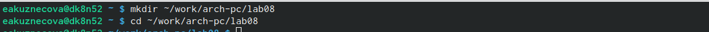{#fig:001 width=80%}

С помощью утилиты touch создала файл lab8-1.asm (рис. [-@fig:002]).

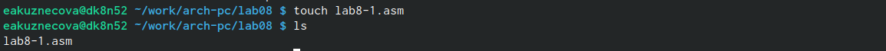{#fig:002 width=80%}

Скопировала в текущий каталог файл in_out.asm с помощью утилиты cp, так как он будет использоваться в других программах (рис. [-@fig:003]).

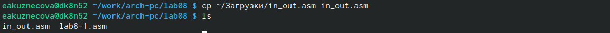{#fig:003 width=80%}

Открыла созданный файл lab8-1.asm, вставила в него программу вывода значения регистра eax 
(рис. [-@fig:004]).

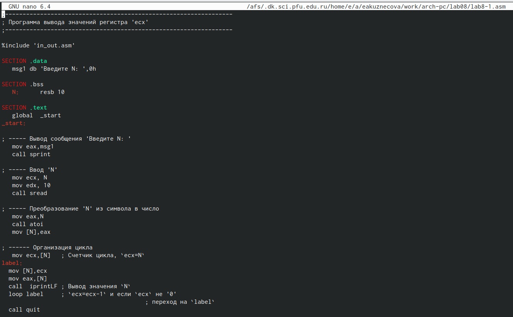{#fig:004 width=80%}

Создала исполняемый файл программы и запустила его. Проверила его работу несколько раз(рис. [-@fig:005]).

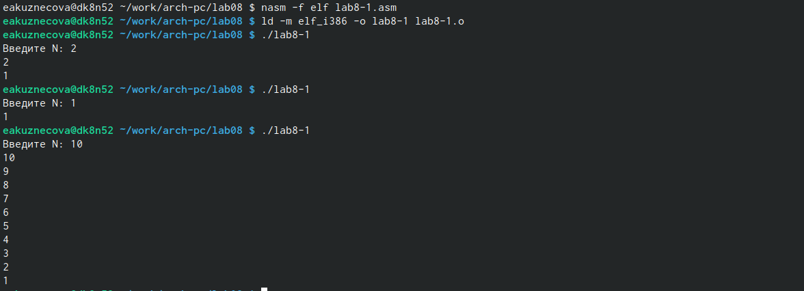{#fig:005 width=80%}

Изменила текст программы файла lab8-1.asm, добавив изменение значения регистра ecx в цикле label (рис. [-@fig:006]).

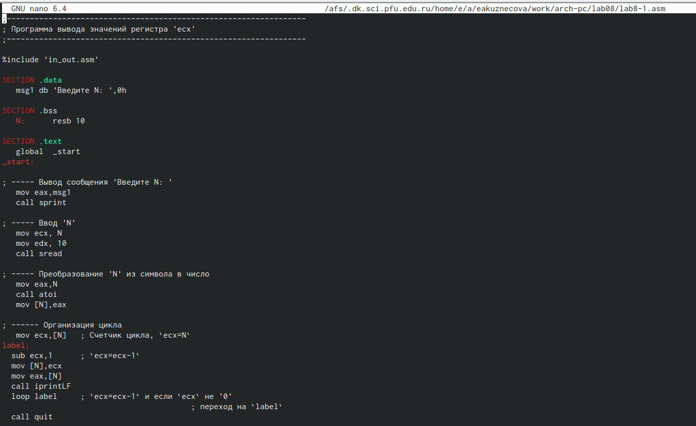{#fig:006 width=80%}

Создала новый исполняемый файл программы и запустила его. В этой программе уменьшился изначальный индекс на 1. Получился результат, который отличается от ожидаемого. Получили N/2 значений (рис. [-@fig:007]).

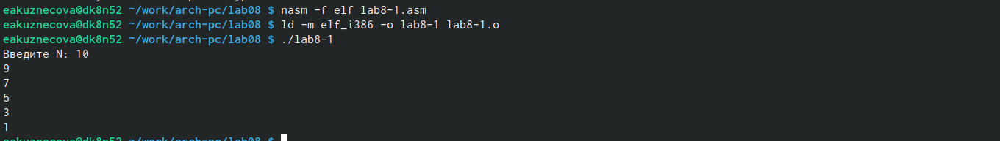{#fig:007 width=80%}

Изменила текст программы файла lab8-1.asm, в которую были добавлены изменения значения регистра ecx в цикле label, использовала стек (воспользовалась командами push и pop) (рис. [-@fig:008]).

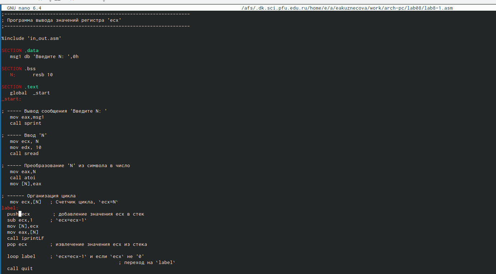{#fig:008 width=80%}

Создала новый исполняемый файл программы и запустила его. В этой программе вывелся нужный нам результат (N значений) (рис. [-@fig:009]).

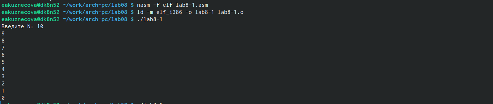{#fig:009 width=80%}

С помощью утилиты touch создала файл lab8-2.asm (рис. [-@fig:010]).

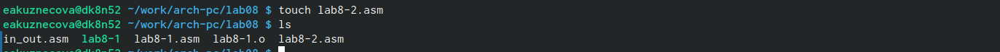{#fig:010 width=80%}

Открыла созданный файл lab8-2.asm, вставила в него программу по обработке аргументов командной строки (рис. [-@fig:011]).

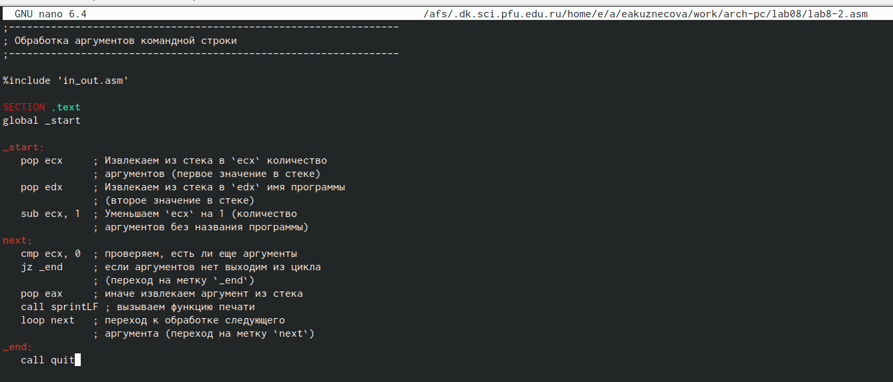{#fig:011 width=80%}

Создала новый исполняемый файл программы и запустила его, указав аргументы. Были обработы все введенные аргументы (рис. [-@fig:012]).

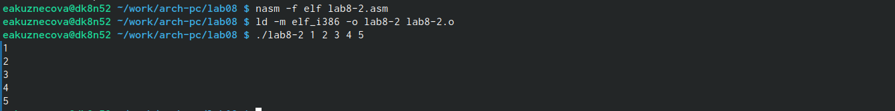{#fig:012 width=80%}

С помощью утилиты touch создала файл lab8-3.asm (рис. [-@fig:010]).

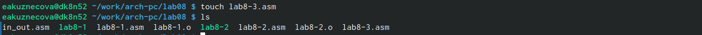{#fig:013 width=80%}

Открыла созданный файл lab8-3.asm, вставила в него программу вычисления суммы аргументов командной строки (рис. [-@fig:014]).

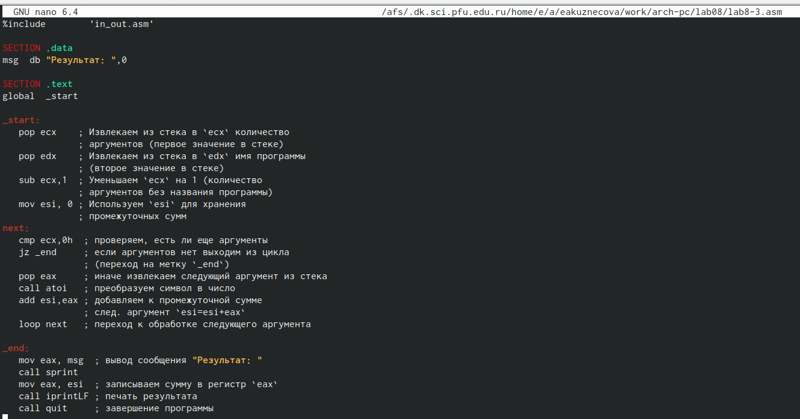{#fig:014 width=80%}

Создала новый исполняемый файл программы и запустила его, указав аргументы. Была выведена правильная сумма аргументов (рис. [-@fig:015]).

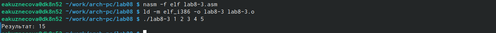{#fig:015 width=80%}

С помощью утилиты touch создала файл lab8-4.asm (рис. [-@fig:016]).

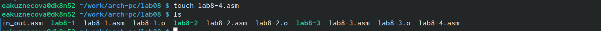{#fig:016 width=80%}

Открыла созданный файл lab8-4.asm, вставила в него программу вычисления произведения аргументов командной строки (рис. [-@fig:017]).

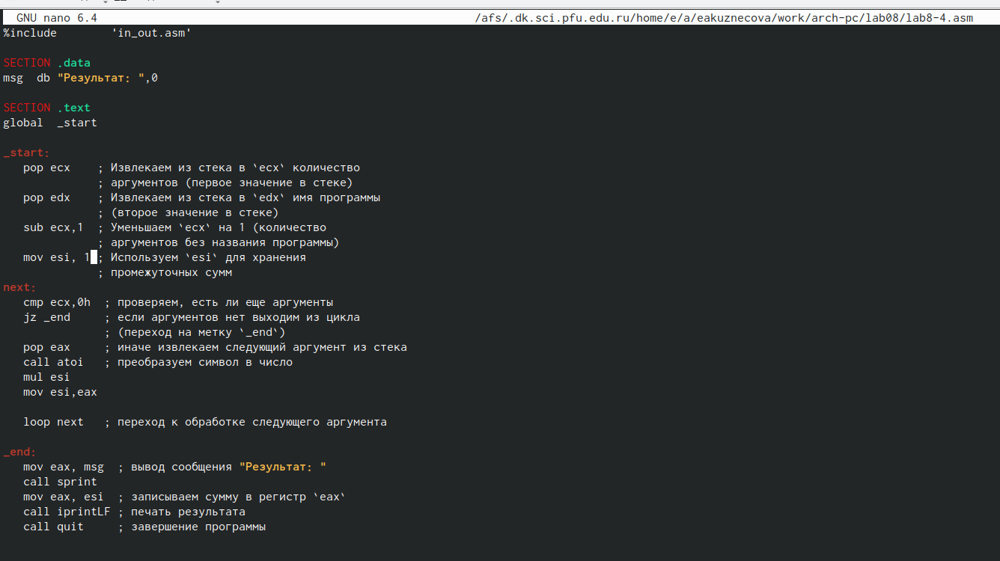{#fig:017 width=80%}

Создала новый исполняемый файл программы и запустила его, указав аргументы. Было выведено правильное произведение аргументов (рис. [-@fig:018]).

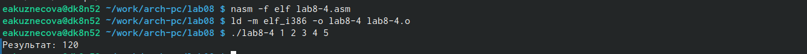{#fig:018 width=80%}

# Программа для вычисления произведения аргументов командной строки
```NASM
%include        'in_out.asm'

SECTION .data
msg  db "Результат: ",0

SECTION .text
global  _start

_start:
   pop ecx    ; Извлекаем из стека в `ecx` количество
              ; аргументов (первое значение в стеке)
   pop edx    ; Извлекаем из стека в `edx` имя программы
              ; (второе значение в стеке)
   sub ecx,1  ; Уменьшаем `ecx` на 1 (количество
              ; аргументов без названия программы)
   mov esi, 1 ; Используем `esi` для хранения
              ; промежуточных сумм
next:
   cmp ecx,0h  ; проверяем, есть ли еще аргументы
   jz _end     ; если аргументов нет выходим из цикла
               ; (переход на метку `_end`)
   pop eax     ; иначе извлекаем следующий аргумент из стека
   call atoi   ; преобразуем символ в число
   mul esi
   mov esi,eax

   loop next   ; переход к обработке следующего аргумента

_end:
   mov eax, msg  ; вывод сообщения "Результат: "
   call sprint
   mov eax, esi  ; записываем сумму в регистр `eax`
   call iprintLF ; печать результата
   call quit     ; завершение программы
```

# Выполнение заданий для самостоятельной работы

Создала файл lab8-5.asm с помощью утилиты touch (рис. [-@fig:019]).

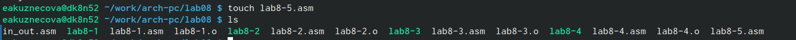{#fig:019 width=80%}

Открыла созданный файл и ввела в него текст программы, которая находит сумму значений функции f(x)=3(10+x), которое было под 20 вариантом (рис. [-@fig:020]).

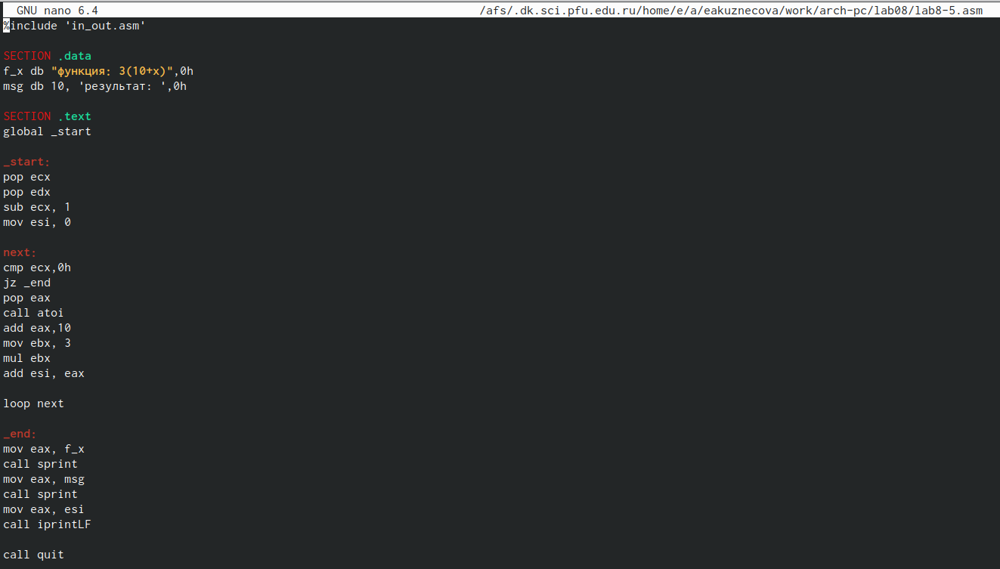{#fig:020 width=80%}

Создала новый исполняемый файл и запустила его. Проверила свою программу на трех наборах x. Все значения выводятся верно. (рис. [-@fig:021]).

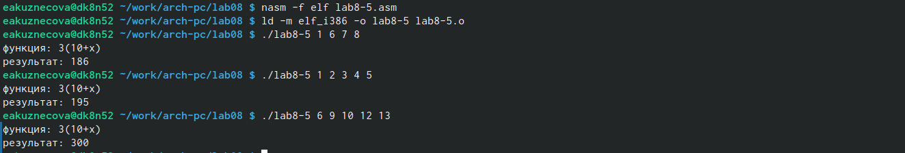{#fig:021 width=80%}

# Программа для вычисления значения выражения 3(10+x)
```NASM
%include 'in_out.asm'

SECTION .data
f_x db "функция: 3(10+x)",0h
msg db 10, 'результат: ',0h

SECTION .text
global _start

_start:
pop ecx
pop edx
sub ecx, 1
mov esi, 0

next:
cmp ecx,0h
jz _end
pop eax
call atoi
add eax,10
mov ebx, 3
mul ebx
add esi, eax

loop next

_end:
mov eax, f_x
call sprint
mov eax, msg
call sprint
mov eax, esi
call iprintLF

call quit
```

# Выводы

В ходе этой лабораторной работы были получены навыки по организации циклов и работе со стеком на языке NASM.


