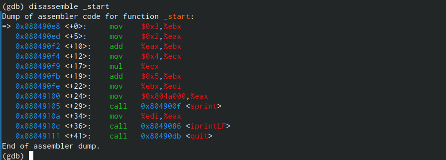

---
## Front matter
title: "Отчёт по лабораторной работе №9"
subtitle: "Дисциплина: архитектура компьютера"
author: "Кузнецова Елизавета Андреевна"

## Generic otions
lang: ru-RU
toc-title: "Содержание"

## Bibliography
bibliography: bib/cite.bib
csl: pandoc/csl/gost-r-7-0-5-2008-numeric.csl

## Pdf output format
toc: true # Table of contents
toc-depth: 2
lof: true # List of figures
lot: true # List of tables
fontsize: 12pt
linestretch: 1.5
papersize: a4
documentclass: scrreprt
## I18n polyglossia
polyglossia-lang:
  name: russian
  options:
	- spelling=modern
	- babelshorthands=true
polyglossia-otherlangs:
  name: english
## I18n babel
babel-lang: russian
babel-otherlangs: english
## Fonts
mainfont: PT Serif
romanfont: PT Serif
sansfont: PT Sans
monofont: PT Mono
mainfontoptions: Ligatures=TeX
romanfontoptions: Ligatures=TeX
sansfontoptions: Ligatures=TeX,Scale=MatchLowercase
monofontoptions: Scale=MatchLowercase,Scale=0.9
## Biblatex
biblatex: true
biblio-style: "gost-numeric"
biblatexoptions:
  - parentracker=true
  - backend=biber
  - hyperref=auto
  - language=auto
  - autolang=other*
  - citestyle=gost-numeric
## Pandoc-crossref LaTeX customization
figureTitle: "Рис."
tableTitle: "Таблица"
listingTitle: "Листинг"
lofTitle: "Список иллюстраций"
lotTitle: "Список таблиц"
lolTitle: "Листинги"
## Misc options
indent: true
header-includes:
  - \usepackage{indentfirst}
  - \usepackage{float} # keep figures where there are in the text
  - \floatplacement{figure}{H} # keep figures where there are in the text
---

# Цель работы

Освоить работу с подпрограммами и отладчиком gdb.

# Задание

1. Ознакомиться с листингами и использовать их при работе gdb.
2. Выполнить задания для самостоятельной работы.
3. Загрузить файлы на Github.

# Теоретическое введение

Отладка — это процесс поиска и исправления ошибок в программе. В общем случае его
можно разделить на четыре этапа: обнаружение ошибки, поиск её местонахождения, определение причины ошибки, исправление ошибки.
Наиболее часто применяют следующие методы отладки: создание точек контроля значений на входе и выходе участка программы (например,вывод промежуточных значений на экран — так называемые диагностические сообщения); использование специальных программ-отладчиков.
GDB (GNU Debugger — отладчик проекта GNU) работает на многих UNIX-подобных
системах и умеет производить отладку многих языков программирования. GDB может выполнять следующие действия: начать выполнение программы, задав всё, что может повлиять на её поведение; остановить программу при указанных условиях; исследовать, что случилось, когда программа остановилась;изменить программу так, чтобы можно было поэкспериментировать с устранением эффектов одной ошибки и продолжить выявление других.

# Выполнение лабораторной работы

С помощью утилиты mkdir создала директорию, в которой буду создавать файлы с программами для лабораторной работы. Перешла в созданный каталог с помощью утилиты cd (рис. [-@fig:001]).

{#fig:001 width=80%}

С помощью утилиты touch создала файл lab09-1.asm (рис. [-@fig:002]).

{#fig:002 width=80%}

Скопировала в текущий каталог файл in_out.asm с помощью утилиты cp, так как он будет использоваться в других программах (рис. [-@fig:003]).

{#fig:003 width=80%}

Открыла созданный файл lab09-1.asm, вставила в него программу (рис. [-@fig:004]).

{#fig:004 width=80%}

Создала исполняемый файл программы и запустила его. Результат данной программы являлся правильным (рис. [-@fig:005]).

{#fig:005 width=80%}

Изменила текст программы, добавив подпрограмму _subcalcul в подрограмму _calcul
(рис. [-@fig:006]).

{#fig:006 width=80%}

Создала новый исполняемый файл программы и запустила его. Результат данной программы являлся правильным (рис. [-@fig:007]).

{#fig:007 width=80%}

С помощью утилиты touch создала файл lab09-2.asm (рис. [-@fig:008]).

{#fig:008 width=80%}

Открыла созданный файл lab09-2.asm, вставила в него программу (рис. [-@fig:009]).

{#fig:009 width=80%}

Создала новый исполняемый файл программы. Для работы с GDB в исполняемый файл добавила отладочную информацию, провела трансляцию программ с ключом ‘-g’. Загрузила исполняемый файл в отладчик gdb (рис. [-@fig:010]).

{#fig:010 width=80%}

Проверила работу программы, запустив ее в оболочке GDB с помощью команды run (сокращённо r) (рис. [-@fig:011]).

{#fig:011 width=80%}

Для более подробного анализа программы установила брейкпоинт на метку _start и запустила её (рис. [-@fig:012]).

{#fig:012 width=80%}

Посмотрела дисассимилированный код программы с помощью команды disassemble, начиная с метки _start (рис. [-@fig:013]).

{#fig:013 width=80%}

Переключилась на отображение команд с Intel’овским синтаксисом, введя команду set
disassembly-flavor intel (рис. [-@fig:014]). В представлении ATT в виде 16-ричного числа записаны первые аргументы всех команд, а в представлении intel так записываются адреса вторых аргументов.

{#fig:014 width=80%}

Включила режим псевдографики для более удобного анализа программы (рис. [-@fig:015]).

{#fig:015 width=80%}

Посмотрела информацию о наших точках останова. Сделала это с помощью команды info breakpoints (кратко i b) (рис. [-@fig:016]).

{#fig:016 width=80%}

Добавила еще одну точку останова по адресу инструкции. Посмотрела информацию о всех установленных точках останова (рис. [-@fig:017]).

{#fig:017 width=80%}

Выполнила 5 инструкций с помощью команды stepi и проследила за изменением значений регистров. Значение регистров eax,ecx,edx,ebx (рис. [-@fig:018]).

{#fig:018 width=80%}

Вывела текущее значение переменных (msg1 и msg2) по имени и по адресу (рис. [-@fig:019]).

{#fig:019 width=80%}

Изменила значение переменной msg1 с помощью команды set,задав ей в качестве аргумента адрес переменной и имя переменной (рис. [-@fig:020]). 

{#fig:020 width=80%}

Изменила значение переменной msg2 с помощью команды set,задав ей в качестве аргумента адрес переменной (рис. [-@fig:021]). 

{#fig:021 width=80%}

Вывела в различных форматах (в шестнадцатеричном формате, в двоичном формате и
в символьном виде) значение регистра edx (рис. [-@fig:022]).

{#fig:022 width=80%}

С помощью команды set изменила значение регистра ebx (рис. [-@fig:023]). При попытке задать строчное значение происходит ошибка. Завершила работу в gdb командами continue,она закончила выполнение программы, и exit, она завершила сеанс gdb.

{#fig:023 width=80%}

Скопировала файл из лабораторной 8, создала новый исполняемый файл программы. Для работы с GDB в исполняемый файл добавила отладочную информацию, провела трансляцию программ с ключом ‘-g’. Загрузила исполняемый файл с аргументами в отладчик gdb, использовала ключ --args 
(рис. [-@fig:024]).

{#fig:024 width=80%}

Установила точку останова перед первой инструкцией в программе и запустила ее (рис. [-@fig:025]).

{#fig:025 width=80%}

Посмотрела на содержимое того, что расположено по адресу, находящемуся в регистре esp. Увидела, что число аргументов 5 (рис. [-@fig:026]). Далее посмотрела на все остальные аргументы в стеке. Их адреса располагаются в 4 байтах друг от друга (именно столько занимает элемент стека). 

{#fig:026 width=80%}

# Выполнение заданий для самостоятельной работы

С помощью утилиты touch создала файл lab09-4.asm (рис. [-@fig:027]).

{#fig:027 width=80%}

Открыла созданный файл lab09-4.asm, вставила в него программу из 8 лабораторной, но добавила подрограмму для вычисления функции 20 варианта (рис. [-@fig:028]).

{#fig:028 width=80%}

Создала новый исполняемый файл программы и запустила его. Результат данной программы являлся правильным (рис. [-@fig:029]).

{#fig:029 width=80%}

С помощью утилиты touch создала файл lab09-5.asm (рис. [-@fig:030]).

{#fig:030 width=80%}

Открыла созданный файл lab09-5.asm, вставила в него программу листинга 9.3 (рис. [-@fig:031]).

{#fig:031 width=80%}

Создала новый исполняемый файл программы и запустила его. Результат данной программы являлся неправильным (рис. [-@fig:032]).

{#fig:032 width=80%}

Создала новый исполняемый файл программы. Для работы с GDB в исполняемый файл добавила отладочную информацию, провела трансляцию программ с ключом ‘-g’. Загрузила исполняемый файл в отладчик gdb. Проверила работу программы, запустив ее в оболочке GDB с помощью команды run (сокращённо r). Программа работает неправильно (рис. [-@fig:033]).

{#fig:033 width=80%}

Для более подробного анализа программы установила брейкпоинт на метку _start и запустила её (рис. [-@fig:034]).

{#fig:034 width=80%}

Посмотрела дисассимилированный код программы с помощью команды disassemble, начиная с метки _start (рис. [-@fig:035]).

{#fig:035 width=80%}

Переключилась на отображение команд с Intel’овским синтаксисом, введя команду set
disassembly-flavor intel (рис. [-@fig:036]). 

{#fig:036 width=80%}

Включила режим псевдографики для более удобного анализа программы (рис. [-@fig:037]).

{#fig:037 width=80%}

Посмотрела информацию о наших точках останова.Сделала это с помощью команды info breakpoints (кратко i b) (рис. [-@fig:038]).

{#fig:038 width=80%}

Добавила еще одну точку останова по адресу инструкции.Посмотрела информацию о всех установленных точках останова (рис. [-@fig:039]).

{#fig:039 width=80%}

Выполнила 6 инструкций с помощью команды stepi и нашла все ошибки (рис. [-@fig:040]) и (рис. [-@fig:041])

{#fig:040 width=80%}

{#fig:041 width=80%}

Ошибка была в строках 
```NASM
add ebx,eax
mov ecx,4
mul ecx
add ebx,5
mov edi,ebx
```
Изменила текст программы lab09-5.asm, чтобы выводился правильный ответ (рис. [-@fig:042]).

{#fig:042 width=80%}

Создала новый исполняемый файл программы.Для работы с GDB в исполняемый файл добавила отладочную информацию, провела трансляцию программ с ключом ‘-g’. Загрузила исполняемый файл в отладчик gdb. Проверила работу программы, запустив ее в оболочке GDB с помощью команды run (сокращённо r). Результат вывелся правильно (рис. [-@fig:043]).

{#fig:043 width=80%}

# Выводы

В результате выполнения работы, я научилась организовывать код в подпрограммы и познакомилась с базовыми функциями откладчика gdb.


