---
## Front matter
title: "Отчёт по лабораторной работе №10"
subtitle: "Дисциплина: архитектура компьютера"
author: "Кузнецова Елизавета Андреевна"

## Generic otions
lang: ru-RU
toc-title: "Содержание"

## Bibliography
bibliography: bib/cite.bib
csl: pandoc/csl/gost-r-7-0-5-2008-numeric.csl

## Pdf output format
toc: true # Table of contents
toc-depth: 2
lof: true # List of figures
lot: true # List of tables
fontsize: 12pt
linestretch: 1.5
papersize: a4
documentclass: scrreprt
## I18n polyglossia
polyglossia-lang:
  name: russian
  options:
	- spelling=modern
	- babelshorthands=true
polyglossia-otherlangs:
  name: english
## I18n babel
babel-lang: russian
babel-otherlangs: english
## Fonts
mainfont: PT Serif
romanfont: PT Serif
sansfont: PT Sans
monofont: PT Mono
mainfontoptions: Ligatures=TeX
romanfontoptions: Ligatures=TeX
sansfontoptions: Ligatures=TeX,Scale=MatchLowercase
monofontoptions: Scale=MatchLowercase,Scale=0.9
## Biblatex
biblatex: true
biblio-style: "gost-numeric"
biblatexoptions:
  - parentracker=true
  - backend=biber
  - hyperref=auto
  - language=auto
  - autolang=other*
  - citestyle=gost-numeric
## Pandoc-crossref LaTeX customization
figureTitle: "Рис."
tableTitle: "Таблица"
listingTitle: "Листинг"
lofTitle: "Список иллюстраций"
lotTitle: "Список таблиц"
lolTitle: "Листинги"
## Misc options
indent: true
header-includes:
  - \usepackage{indentfirst}
  - \usepackage{float} # keep figures where there are in the text
  - \floatplacement{figure}{H} # keep figures where there are in the text
---

# Цель работы

Цедью работы является приобретение навыков написания программ для работы с файлами.

# Задание

1. Выполнить ход работы и задания для самостоятельной работы.
2. Загрузить файлы на Github.

# Теоретическое введение

ОС GNU/Linux является многопользовательской операционной системой. И для обеспечения защиты данных одного пользователя от действий других пользователей существуют специальные механизмы разграничения доступа к файлам. Кроме ограничения доступа, данный механизм позволяет разрешить другим пользователям доступ данным для совместной работы.
Права доступа определяют набор действий (чтение, запись, выполнение), разрешённых
для выполнения пользователям системы над файлами. Для каждого файла пользователь
может входить в одну из трех групп: владелец, член группы владельца, все остальные. Для
каждой из этих групп может быть установлен свой набор прав доступа. Владельцем файла
является его создатель.
В операционной системе Linux существуют различные методы управления файлами, например, такие как создание и открытие файла, только для чтения или для чтения и записи,добавления в существующий файл, закрытия и удаления файла, предоставление прав доступа.
Обработка файлов в операционной системе Linux осуществляется за счет использования
определенных системных вызовов. Для корректной работы и доступа к файлу при его открытии или создании, файлу присваивается уникальный номер (16-битное целое число) – дескриптор файла.

# Выполнение лабораторной работы

С помощью утилиты mkdir создала директорию, в которой буду создавать файлы с программами для лабораторной работы. Перешла в созданный каталог с помощью утилиты cd (рис. [-@fig:001]).

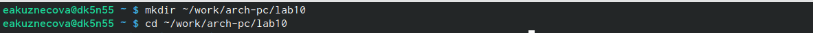{#fig:001 width=80%}

С помощью утилиты touch создала файлы lab10-1.asm, readme-1.txt, readme-2.txt (рис. [-@fig:002]).

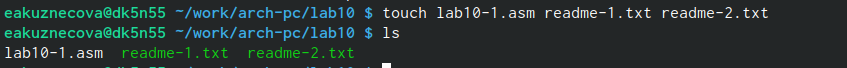{#fig:002 width=80%}

Скопировала в текущий каталог файл in_out.asm с помощью утилиты cp, так как он будет использоваться в других программах (рис. [-@fig:003]).

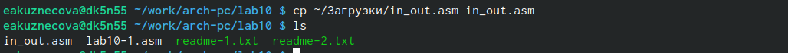{#fig:003 width=80%}

Открыла созданный файл lab10-1.asm, вставила в него программу записи в файл строки введененой на запрос (рис. [-@fig:004]).

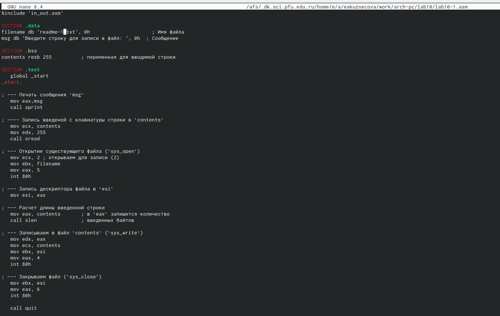{#fig:004 width=80%}

Создала исполняемый файл программы и запустила его. Проверила его работу (рис. [-@fig:005]).

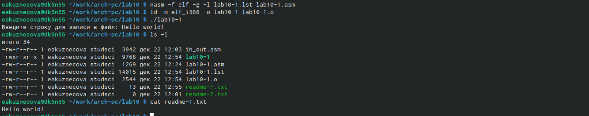{#fig:005 width=80%}

Я запретила выполнение исполняемого файла lab10-1, использовав команду chmod для изменения прав доступа. Избавилась от атрибута "x" во всех трех позициях. После я попыталсь выполнить файл, но файл не запускается. Выполнение запрещено из-за отсутвия атрибута "x" во всех трех позициях (рис. [-@fig:006]).

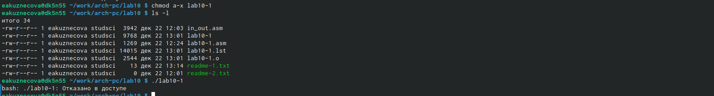{#fig:006 width=80%}

Изменила права доступа к файлу lab10-1.asm, использовав команду chmod для изменения прав доступа. Увидела, что команды не найдены, возникли ошибки. Терминал пытался выполнить содержимое файла как команды командной строки. Файл с расширением .asm не предназначен для такакого использования (рис. [-@fig:007]).

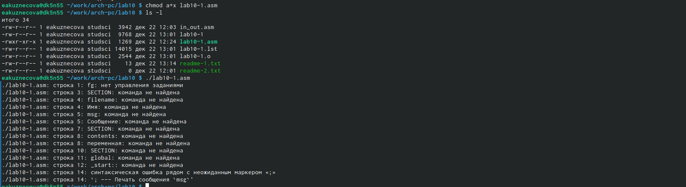{#fig:007 width=80%}

Установила права доступа к файлу readme-2.txt (двоичный вид) в соотвествии со своим вариантом (20 вариант). Использовала команду ls -l, чтобы проверить правильность выполнения (рис. [-@fig:008]).

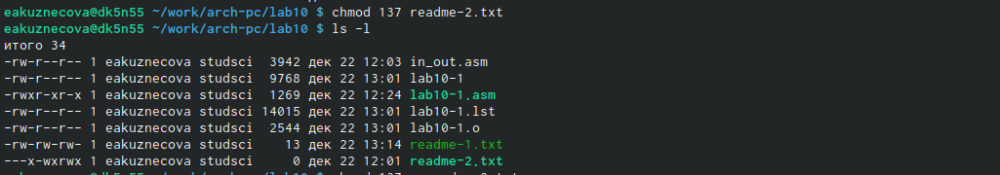{#fig:008 width=80%}

Установила права доступа к файлу readme-1.txt (символьный вид) в соотвествии со своим вариантом (20 вариант). Использовала команду ls -l, чтобы проверить правильность выполнения (рис. [-@fig:009]).

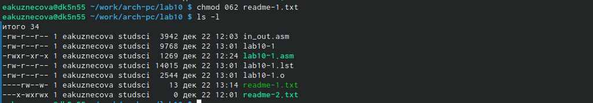{#fig:009 width=80%}

# Выполнение заданий для самостоятельной работы

Создала файлы lab10-2.asm и name.txt с помощью утилиты touch (рис. [-@fig:010]).

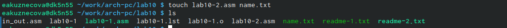{#fig:010 width=80%}

Открыла созданный файл lab10-2.asm, вставила в него программу записи в файл строки введененой на запрос (рис. [-@fig:011]).

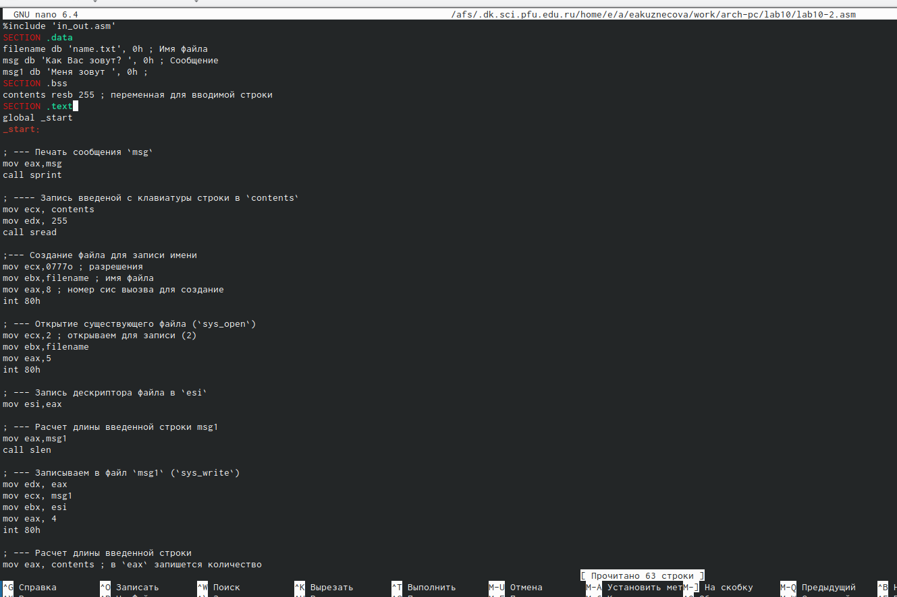{#fig:011 width=80%}

Создала исполняемый файл и запустила программу. С помощью команд cat и ls -l убедилась в правильности ее выполнения. Файл вывел корректную информацию (рис. [-@fig:012]).

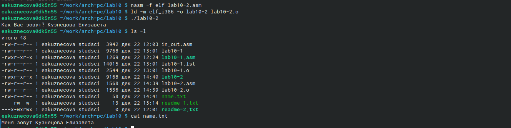{#fig:012 width=80%}

# Программа, использованная для самостоятельной работы 
```NASM
%include 'in_out.asm'
SECTION .data
filename db 'name.txt', 0h ; Имя файла
msg db 'Как Вас зовут? ', 0h ; Сообщение
msg1 db 'Меня зовут ', 0h ;
SECTION .bss
contents resb 255 ; переменная для вводимой строки
SECTION .text
global _start
_start:

; --- Печать сообщения `msg`
mov eax,msg
call sprint

; ---- Запись введеной с клавиатуры строки в `contents`
mov ecx, contents
mov edx, 255
call sread

;--- Создание файла для записи имени
mov ecx,0777o ; разрешения
mov ebx,filename ; имя файла
mov eax,8 ; номер сис выозва для создание
int 80h

; --- Открытие существующего файла (`sys_open`)
mov ecx,2 ; открываем для записи (2)
mov ebx,filename
mov eax,5
int 80h

; --- Запись дескриптора файла в `esi`
mov esi,eax

; --- Расчет длины введенной строки msg1
mov eax,msg1
call slen

; --- Записываем в файл `msg1` (`sys_write`)
mov edx, eax
mov ecx, msg1
mov ebx, esi
mov eax, 4
int 80h

; --- Расчет длины введенной строки
mov eax, contents ; в `eax` запишется количество
call slen ; введенных байтов

; --- Записываем в файл `contents` (`sys_write`)
mov edx, eax
mov ecx, contents
mov ebx, esi
mov eax, 4
int 80h

; --- Закрываем файл (`sys_close`)
mov ebx, esi
mov eax, 6
int 80h

call quit
```

# Выводы

В ходе этой лабораторной работы были получены навыки по написанию программ для работы с файлами. Ознакомилась с правами доступа.
